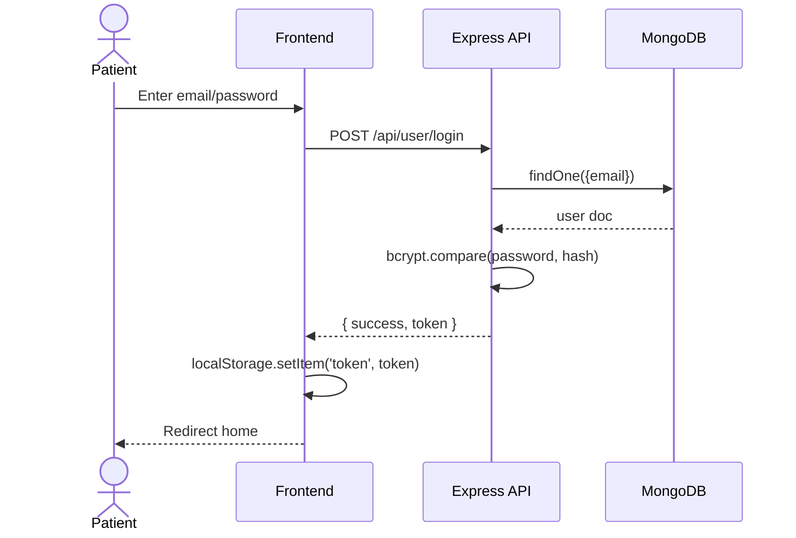
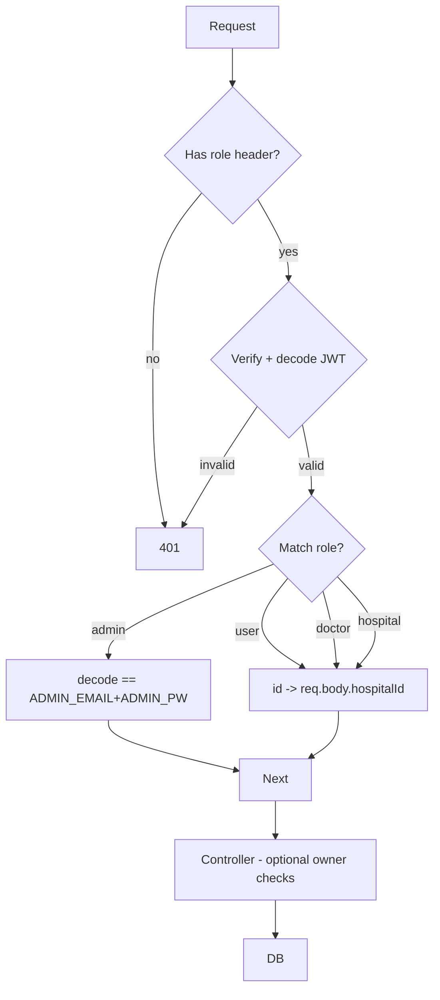
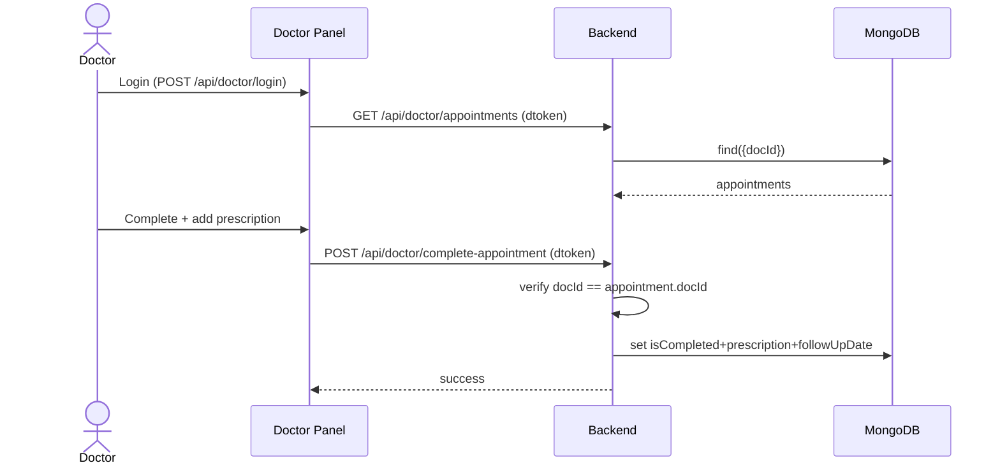
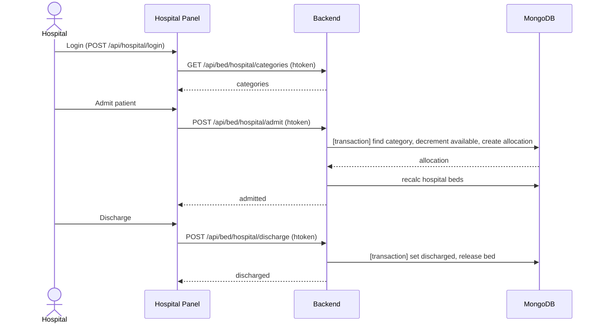
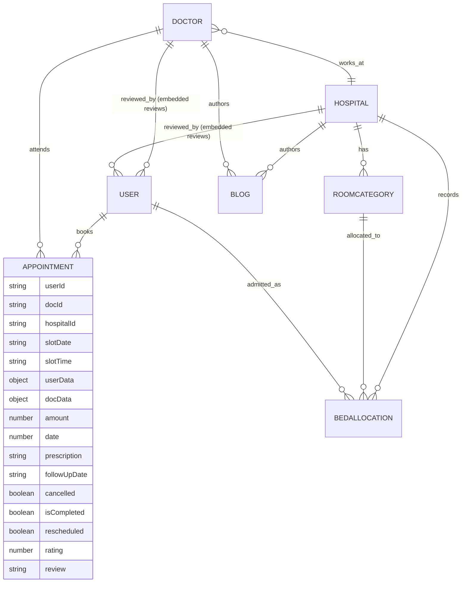

# HEALHUB
## PRODUCT, BUSINESS & TECHNICAL BLUEPRINT
### Version 1.0

---

# Document Control

| Field | Value |
|-------|-------|
| **Product** | Healhub |
| **Document** | Product, Business & Technical Blueprint |
| **Version** | 1.0 |
| **Date** | 03 September 2026 |
| **Status** | Baseline / Current-State Assessment |
| **Primary Source** | Healhub source code (local workspace) |
| **Supporting Sources** | Repository documentation, configuration, env templates |
| **Scope** | Product, business, functional, technical, security, data, analytics, roadmap assessment |
| **Classification** | Internal — Evidence-based |

### Repository Review Baseline

| Repository | Role | Branch (last local commit) | Evidence Depth |
|------------|------|---------------------------|----------------|
| `backend` | Express API server | `c6d1bc9` | HIGH |
| `frontend` | Patient-facing React SPA | `27aa7f8` | HIGH |
| `admin` | Role-based Admin/Doctor/Hospital panel (React SPA) | `53191e0` | HIGH |

> **Methodology statement:** Documentation methodology is adapted from the supplied reference BRD. All Healhub business, functional and technical content is independently derived from the Healhub codebase and is **not copied** from the reference domain.

### Evidence Confidence Legend

| Level | Meaning |
|-------|---------|
| **HIGH** | Directly confirmed from source implementation. |
| **MEDIUM** | Supported by multiple implementation/documentation signals. |
| **LOW** | Reasonably inferred but not fully confirmed. |
| **UNKNOWN** | Unable to determine from the current codebase. |

---

# Table of Contents

1. Executive Summary
2. Product Overview
3. Problem Statement
4. Vision, Mission & Product Philosophy
5. Target Users & Stakeholders
6. Product Positioning & Differentiation
7. Product / System Architecture
8. User & Identity
9. Core Business Modules
10. Intelligence / Automation Assessment
11. Provider / Doctor / Hospital Platform
12. Administration & Moderation
13. Trust, Safety, Security & Governance
14. Search, Discovery & Communication
15. Analytics & KPIs
16. Core User Journeys
17. Major Business Workflows
18. Data Architecture
19. API & Integration Architecture
20. Technical Architecture
21. Security & Non-Functional Requirements
22. User Roles & Permissions
23. Current-State Assessment
24. Functional Gaps
25. Technical Debt
26. Risks & Mitigation
27. Current vs Target State
28. Roadmap
29. Product Principles
30. Final Product Positioning

Appendix A — Complete Feature Inventory
Appendix B — User Role & Permission Matrix
Appendix C — Business Requirements
Appendix D — Functional Requirements
Appendix E — Non-Functional Requirements
Appendix F — Security Requirements
Appendix G — Data Requirements
Appendix H — Integration Requirements
Appendix I — Business Rules
Appendix J — API Inventory
Appendix K — Data Dictionary
Appendix L — KPI Dictionary
Appendix M — Traceability Matrix
Appendix N — Risk Register
Appendix O — Technical Debt Register
Appendix P — Glossary
Appendix Q — Open Questions / Decisions
Appendix R — Evidence Map

---

# 1. Executive Summary

## What Healhub Is

Healhub is a **healthcare management and appointment-booking platform** built as a three-part web application: a **patient-facing frontend** (`frontend/`), a **role-based operational panel** (`admin/`) covering platform-admin, doctor, and hospital/clinic operations, and a **Node.js/Express REST API backend** (`backend/`) backed by MongoDB.

## What User Problem It Solves

The system connects **patients** with **doctors** and **hospitals/clinics** for appointment discovery and booking, and provides operational tooling for doctors, hospitals, and platform administrators (doctor/hospital management, appointment handling, room & bed allocation, content, and analytics).

## Who Uses It

Four distinct actor groups are implemented:
1. **Patient/User** — patient-facing SPA.
2. **Doctor** — doctor panel in the admin SPA.
3. **Hospital/Clinic** — hospital panel in the admin SPA.
4. **Platform Admin** — admin panel in the admin SPA.

## Major Supported Workflows

- Patient registration & login; profile management; doctor/hospital discovery; appointment booking (in-person); appointment reschedule/cancel; rating/review; prescription viewing.
- Doctor login; appointment completion; prescription writing; schedule & blocked-date management; analytics & revenue view.
- Hospital login; doctor onboarding; room/bed category management; patient admission/discharge; analytics; blogs.
- Admin login; doctor/hospital onboarding; appointment oversight; room/bed management; content moderation; analytics; dashboard.

## Current Product Surfaces

| Surface | Technology | Deployment Signal |
|---------|-----------|-------------------|
| Patient frontend | React 19 + Vite, Tailwind, React Router, Axios | Vercel (`vercel.json`), PWA manifest + service worker |
| Admin multi-role panel | React 19 + Vite, Tailwind, Recharts | Vercel |
| Backend API | Node.js + Express 5 + Mongoose | `Server.js` |

## Major Integrations

- **Cloudinary** — image upload/storage for users, doctors, hospitals, blogs.
- **MongoDB** — primary datastore.
- **Local app assets** — static images bundled in repo.

## Most Important Current Strengths

- Clear separation of three application surfaces.
- Backend-enforced role authorization (`authAdmin`, `authDoctor`, `authHospital`, `authUser` middleware) on sensitive endpoints.
- Meaningful analytics for admin, doctor, and hospital.
- Transactional bed allocation (`mongoose` sessions/transactions).
- Extensive role-scoped blog/content management.

## Major Limitations & Gaps

- **No router-level route protection** on either frontend; authorization is ad-hoc and, at the UI layer, purely cosmetic.
- **Admin JWT** embeds `email+password` in the token payload (secret leakage risk) — Section 13.
- **No email/SMS notifications** despite README claims.
- **Client tokens in `localStorage`** (XSS exposure), no token expiry configured.
- **Contract/consistency drift** across surfaces (currency ₹ vs $, field-name mismatches, duplicate slot logic) — Sections 24–25.
- **`.env` files are committed to the repository.**

## Evolutions Indicated by Evidence

The codebase is being actively extended toward **hospital/clinic operations** (rooms, beds, admission/discharge) and **content publishing** (role-scoped blogs), beyond a pure appointment-booking market. Analytics and rating/review features are the most recently expanded.

## CURRENT STATE vs RECOMMENDED FUTURE STATE

This document separates **current-state** (implemented, evidenced) functionality from **proposed/recommended future state**. All *[PROPOSED]* and *[FUTURE]* items are expressly not part of the current implementation.

---

# 2. Product Overview

Actual product capabilities as evidenced in the codebase.

| Product Area | Purpose | Current Status | Evidence |
|--------------|---------|----------------|----------|
| Patient registration | Create a user account | [IMPLEMENTED] | `userController.registerUser`, `userRoute POST /register` |
| Patient login | Authenticate patient | [IMPLEMENTED] | `userController.loginUser` |
| Doctor discovery | List/search doctors | [IMPLEMENTED] | `doctorController.doctorList`, `GET /api/doctor/list` |
| Hospital discovery | List/search hospitals w/ geo-filter | [IMPLEMENTED] | `hospitalController.listHospitals` |
| Hospital profile | Hospital + its doctors + room availability | [IMPLEMENTED] | `getHospitalProfile`, `getPublicRoomAvailability` |
| Appointment booking | Book in-person slot | [IMPLEMENTED] | `bookAppointment`, `POST /api/user/book-appointment` |
| Appointment reschedule | Change date/time | [IMPLEMENTED] | `rescheduleAppointment` |
| Appointment cancel | Cancel (user/admin/doctor) | [IMPLEMENTED] | `cancelUserAppointment`, `appointmentCancel`, `cancelDoctorAppointment` |
| Appointment completion | Mark completed + prescription | [IMPLEMENTED] | `completeDoctorAppointment`, `addPrescription` |
| Prescription | Free-text prescription + follow-up date | [IMPLEMENTED] | `appointmentModel.prescription, followUpDate` |
| Doctor availability | Weekly schedule + blocked dates | [IMPLEMENTED] | `updateDoctorSchedule`, `addBlockedDates`, etc. |
| Patient profile | View/update profile + image | [IMPLEMENTED] | `updateUserProfile`, `/api/user/update-profile` |
| Doctor profile | Update fees/address/availability | [IMPLEMENTED] | `updateDoctorProfile` |
| Hospital profile | Update hospital info + image | [IMPLEMENTED] | `updateHospitalProfile` |
| Bed/room management | Room categories CRUD | [IMPLEMENTED] | `bedController` admin + hospital variants |
| Patient admission | Allocate bed (transactional) | [IMPLEMENTED] | `admitPatient`, `hospitalAdmitPatient` |
| Patient discharge | Release bed | [IMPLEMENTED] | `dischargePatient`, `hospitalDischargePatient` |
| Rating/review | Rate completed appointment (doctor+hospital) | [IMPLEMENTED] | `rateAppointment` |
| Health blogs | Create/publish/modify/delete, role-scoped | [IMPLEMENTED] | `blogController` |
| Analytics | Admin/doctor/hospital dashboards | [IMPLEMENTED] | `analyticsController`, `doctorAnalytics`, `hospitalPanelAnalytics` |
| Homepage stats | User/doctor/hospital counts | [IMPLEMENTED] | `getStats`, `/api/user/stats` |
| Admin dashboard | Global counts + latest appointments | [IMPLEMENTED] | `adminDashboard` |
| Authentication (all roles) | JWT login/logout | [IMPLEMENTED] | auth middlewares |
| Notifications (email/SMS) | Send confirmations/reminders | [MISSING] | No email/SMS service found |

---

# 3. Problem Statement

Derived from actual functionality (no invented business goals).

## User Friction Addressed

- Patients discover doctors filtered by speciality (**MEDIUM**) and hospitals by name/city/speciality/geo-proximity, reducing reliance on phone calls/queues.
- Patients book appointment slots with visibility into a doctor's weekly schedule and blocked dates.
- Patients can view prescriptions and rate experiences.

## Manual Processes It Appears to Replace

- Paper-based/phone appointment scheduling for doctor clinics.
- Manual bed/admission tracking for hospitals (system tracks categories, allocations, availability).

## Workflow Inefficiencies Reduced

- Centralized appointment and doctor/hospital state reduces double booking at the slot level (via `slots_booked`).
- Role-scoped dashboards give doctors, hospitals, and admins operational visibility.

## Limitations Remaining

- **No automated notifications**: no email/SMS/reminder subsystem is implemented.
- **No OPD queue / consultation notes structure**: prescriptions are free text; there is no structured medical record.
- **No IPD clinical documentation, pharmacy, lab, radiology, insurance, inventory, or procurement** — these are *not implemented*.

> Business intent beyond the above cannot be conclusively established from the codebase; statements are limited to observed behavior.

---

# 4. Vision, Mission & Product Philosophy

The codebase does not contain an explicit, versioned product vision or mission statement. The following are **derived** from observed capabilities and are labeled accordingly.

## Derived Philosophy
- **Multi-sided healthcare orchestration** — connecting patients, doctors, hospitals and platform admins through a shared appointment/data backbone (*HIGH*, from three connected surfaces).
- **Data-driven operations** — heavy investment in analytics suggests an intent to power platform/hospital economics (*MEDIUM*).
- **Content as engagement** — role-scoped blogging implies content/SEO as a growth channel (*MEDIUM*).

## Declared (in README) vs Implemented
The README states broad ambitions (HIPAA/GDPR compliance, telemedicine, EHR integration, insurance, pharmacy, ambulance). These are **not supported by source evidence** and are treated respectively as [PROPOSED]/[FUTURE]/[MISSING], not as current capabilities. See Section 24 and Appendix C/D.

---

# 5. Target Users & Stakeholders

| Actor | Description | Responsibilities (as implemented) | System Capabilities | Status |
|-------|-------------|----------------------------------|----------------------|--------|
| **Patient / User** | Person seeking doctor/hospital services | Register, book, rate, track appointments | Discovery, booking, reschedule, cancel, rating, profile, prescriptions | [IMPLEMENTED] |
| **Doctor** | Medical professional on platform | Manage schedule, complete appointments, write prescriptions, publish blogs, view analytics | Doctor panel in admin SPA | [IMPLEMENTED] |
| **Hospital / Clinic** | Facility offering services | Onboard doctors, manage rooms/beds, admit/discharge, publish blogs, view analytics | Hospital panel in admin SPA | [IMPLEMENTED] |
| **Platform Admin** | Operator of the platform | Onboard doctors/hospitals, oversee appointments, manage rooms, content, analytics | Admin panel in admin SPA | [IMPLEMENTED] |

> No in-code roles beyond these four were discovered. `hospital staff/reception` is not a distinct technical role; hospital operations are performed under the hospital token.

### Per-Actor: Authentication, Modules, Permissions, Restrictions

| Actor | Auth path | Token header | Accessible modules | Backend enforcement |
|-------|-----------|--------------|--------------------|---------------------|
| Patient | `POST /api/user/login` | `token` | user profile, appointments, booking, rating, stats | `authUser` |
| Doctor | `POST /api/doctor/login` | `dtoken` | doctor panel APIs | `authDoctor` |
| Hospital | `POST /api/hospital/login` | `htoken` | hospital panel APIs, own-bed, own-blog | `authHospital` |
| Admin | `POST /api/admin/login` | `atoken` | all admin APIs, bed/admin blog/analytics | `authAdmin` + comparison against ADMIN_EMAIL/PW |

---

# 6. Product Positioning & Differentiation

## Observed Positioning

Healhub is positioned as a **full-stack healthcare platform** covering patient booking **and** hospital operations (beds, content) — broader than a pure "doctor booking" marketplace.

## Differentiators Evidenced
- **Integrated bed/room allocation** with transactional consistency (unique to this codebase among common booking apps) — *HIGH*.
- **Role-scoped content publishing** (admin/doctor/hospital blogs) — *HIGH*.
- **Multi-role analytics** (platform, doctor, hospital) — *HIGH*.

## Untested / Claimed-but-Not-Evidenced Differentiation
- HIPAA/GDPR/DPDP compliance, AI/telemedicine, mobile apps, insurance — all *[FUTURE]/[MISSING]*, not substantiated in code.

---

# 7. Product / System Architecture

```mermaid
flowchart LR
    subgraph Patient[Patient Frontend - React SPA]
        P[Pages: Home, Doctors, Hospitals, HospitalProfile, Appointment, MyAppointments, MyProfile, Blogs, BlogPost, About, Contact, Login, Demo]
    end
    subgraph Panel[Admin Panel - React SPA (Admin/Doctor/Hospital)]
        A[Admin pages]
        D[Doctor pages]
        H[Hospital pages]
    end
    API[Express REST API<br/>Server.js]
    MID[Auth Middleware<br/>authAdmin/authDoctor/authHospital/authUser]
    MOD[Models<br/>user, doctor, hospital, appointment, roomCategory, bedAllocation, blog]
    DB[(MongoDB - healhub)]
    CLOUD[Cloudinary]

    P -->|HTTP /api| API
    A -->|HTTP /api| API
    D -->|HTTP /api| API
    H -->|HTTP /api| API
    API --> MID --> MOD --> DB
    API --> CLOUD
```

**Architecture type:** Client-server, JSON REST over HTTP, single Express server, MongoDB persistence. No SSR, microservices, or message queues.

---

# 8. User & Identity

## Identity Model
- Four identity classes (patient, doctor, hospital, admin), each issued a distinct JWT with a distinct header name:
  - Patient: `token`, signed with `{ id: user._id }`.
  - Doctor: `dtoken`, `{ id: doctor._id }`.
  - Hospital: `htoken`, `{ id: hospital._id }`.
  - Admin: `atoken`, signed with `email+password` (see security note).

## Registration
- **Patient self-registration** (`registerUser`) with email/password validation (`validator.isEmail`, `validator.isStrongPassword`) and bcrypt hashing. *Promise-based but code contains a duplicate/never-reached second response* (see TD).
- **Doctors & hospitals are NOT self-registering**: doctors added by admin or hospital; hospitals added by admin.

## Authentication Flow (example: patient)

```mermaid
sequenceDiagram
    actor U as Patient
    participant UI as Frontend
    participant API as Express API
    participant DB as MongoDB

    U->>UI: Enter email/password
    UI->>API: POST /api/user/login
    API->>DB: findOne({email})
    DB-->>API: user doc
    API->>API: bcrypt.compare(password, hash)
    API-->>UI: { success, token }
    UI->>UI: localStorage.setItem('token', token)
    UI-->>U: Redirect home
```

---

# 9. Core Business Modules

Each module is documented from business + technical perspectives (per Section 67 of the instruction).

## 9.1 Patient Account & Profile
- **Business:** create/manage identity, personal & contact data, avatar.
- **Technical:** `userModel` (name/email/password/image/address/gender/dob/phone); `registerUser`, `loginUser`, `getUserProfile`, `updateUserProfile`; image upload → Cloudinary via Multer (disk storage).
- **Gap:** no email verification; password-change/forgot-password absent; profile is required completion (address JSON parsed, gender/dob/phone defaulted with sentinel values like `"Not Selected"`/`"000000000"`).

## 9.2 Doctor Management
- **Business:** onboarding, availability toggle, schedule management, analytics, blogs.
- **Technical:** `doctorModel` (incl. `speciality`, `experience`, `degree`, `fees`, `schedule`, `blockedDates`, `slotDuration`, `reviews`, `ratingAverage`, `ratingCount`); admin/hospital add-doctor; `updateDoctorProfile` (fees/address/available only — no image); `doctorAnalytics`.
- **Gap:** doctor image cannot be updated via profile; no doctor self-registration; `changeAvailability` ignores date/slot params (toggles globally).

## 9.3 Hospital Management
- **Business:** onboarding, doctor network, profile, beds/rooms, analytics, blogs.
- **Technical:** `hospitalModel` (city, geo `location` 2dsphere, specialties, `isRegistered`, `totalBeds`/`availableBeds`, `reviews`, `ratingAverage/Count`); `listHospitals` with geo/bed/rating sort; `hospitalPanelAnalytics`.
- **Gap:** hospital `dailyRate` exists only at room-category level; `availableBeds`/`totalBeds` on hospital are derived via `recalcHospitalBeds` but are also manually settable in profile — a **consistency risk** (two sources of truth).

## 9.4 Appointment Management
- **Business:** book, list, reschedule, cancel, complete, rate.
- **Technical:** `appointmentModel` (snapshot `userData`, `docData`, slot, amount, type, status flags: `cancelled`, `isCompleted`, `rescheduled`, rating fields). Slot availability via `doctor.slots_booked`.
- **Gaps:** slot validation in `bookAppointment` only checks `slots_booked`, **not** the doctor weekly schedule or blocked dates (frontend computes these but backend does not re-validate) — see Section 24. No double-booking protection beyond check-then-write (race risk).

## 9.5 Room & Bed Allocation
- **Business:** room categories, admission, discharge, history.
- **Technical:** `roomCategoryModel`, `bedAllocationModel`; MongoDB transactions in bed controllers; `recalcHospitalBeds`.
- **Strengths/Gaps:** admin `admitPatient` does not verify the room category belongs to the hospital (hospital variants do). `transferred` status exists in the enum but is never used.

## 9.6 Content / Blogs
- **Business:** publish health articles by admin, doctor, or hospital.
- **Technical:** `blogModel` (title, slug unique, content, category enum, tags, author, `hospitalId`, `doctorId`, `isPublished`, `publishedAt`, `views`); role-scoped controllers (admin/doctor/hospital) each enforce ownership on update/delete; `getBlogBySlug` increments views and returns related posts.
- **Gap:** no content approval workflow idempotency concerns aside from publish flag; no comment system.

## 9.7 Ratings & Reviews
- **Business:** rate a completed appointment; aggregate for doctor & hospital.
- **Technical:** `rateAppointment` guards (belongs-to-user, must-be-completed, one-per-appointment) then updates doctor + hospital `ratingAverage/Count` and pushes review.
- **Gap:** rating is restricted to the appointment's `hospitalId` only (an appointment may have a doctor with no hospital); no way to edit/delete a rating.

## 9.8 Analytics
- **Business:** platform/doctor/hospital dashboards.
- **Technical:** `analyticsController` (overview, trends 12-month, doctor performance, speciality stats, recent activity, hospital analytics), `doctorAnalytics`, `hospitalPanelAnalytics`. Recharts UI in admin.
- **Gap:** analytics recompute via full-collection scans (performance risk at scale); no aggregations/pipelines for most dashboards.

---

# 10. Intelligence / Automation Assessment

- **AI/ML, recommendation engine, telemedicine AI, chatbots:** [MISSING] / [FUTURE]. No ML or inference code exists.
- **Appointment type:** appointments are **in-person only**; the former "video consultation" type field and its UI toggles have been **removed** end-to-end (schema, API, types, analytics, admin, hospital).
- **Auto-generated doctor recommendations:** [FUTURE]. Only related-doctor/related-blog display logic exists.

---

# 11. Provider / Doctor / Hospital Platform

See Section 9 (9.2 Doctor, 9.3 Hospital) and the per-panel modules in Section 12/22. This chapter documents the provider-facing surface comprehensively:

## Doctor Panel Modules (admin SPA)
Dashboard (earnings/appointments/patients), Appointments (complete/cancel/prescription), Availability (schedule + blocked dates), Analytics (trends), Blogs (CRUD own), Profile (fees/address/availability). *(All [IMPLEMENTED])*

## Hospital Panel Modules (admin SPA)
Dashboard (doctors/appointments), Add Doctor (scoped to own hospital), Doctors List, Manage Rooms/Beds (scoped), Blogs (own + hospital-owned), Analytics, Profile. *(All [IMPLEMENTED])*

> **Observation:** Hospital panel has no patient admission list beyond allocation history; patient admission requires a `patientId` (a registered user in `user` collection), so admitting an unregistered person is not possible without first creating a user account.

---

# 12. Administration & Moderation

## Admin Panel Modules (admin SPA)
Dashboard, All Appointments (filter/search/paginate), Add Doctor, Add Hospital, Hospitals List, Hospital Management (aggregated reception view), Manage Rooms, Doctors List (availability toggle), Add Blog, Blog Posts, Analytics, Hospital Analytics. *(All [IMPLEMENTED])*

## Moderation
- Blog publish/unpublish via `isPublished` and draft state.
- No comment moderation; no review moderation/removal interface (reviews are only deleted via direct DB/admin code — no admin endpoint exists).

---

# 13. Trust, Safety, Security & Governance

## Authentication & Authorization Analysis

### Authentication
- Tokens: patient/doctor/hospital signed `{id}`, no `expiresIn` (long-lived JWTs). Admin token signed with `email+password` string.
- Password hashing via `bcrypt` (salt 10). User, doctor, hospital, admin.
- **Token transport:** client sends token via a custom header (`token`, `dtoken`, `htoken`, `atoken`) — not standard `Authorization: Bearer`.
- **Token storage:** `localStorage` on clients (patient `token`; admin `aToken`, `dToken`, `hToken`). XSS-risk exposure.

### Authorization
- Backend middlewares enforce role on route groups:
  - `authUser` → `req.body.userId = token_decode.id`
  - `authDoctor` → `req.body.docId`
  - `authHospital` → `req.body.hospitalId`
  - `authAdmin` → validates `atoken` decodes to `ADMIN_EMAIL + ADMIN_PW`.
- Owner checks inside controllers (e.g., `appointment.userId !== userId`, `blog.doctorId !== docId`).

```mermaid
flowchart TD
    R[Request] --> H{Has role header?}
    H -- no --> 401
    H -- yes --> V{Verify + decode JWT}
    V -- invalid --> 401
    V -- valid --> M{Match role?}
    M -- admin --> CheckAdmin[decode == ADMIN_EMAIL+ADMIN_PW]
    M -- user --> Attach[id -> req.body.userId]
    M -- doctor --> Attach[id -> req.body.docId]
    M -- hospital --> Attach[id -> req.body.hospitalId]
    CheckAdmin --> Next --> Ctrl[Controller - optional owner checks] --> DB
    Attach --> Next
```

## Security Observations (High-Risk)

| # | Observation | Evidence | Risk |
|---|-------------|----------|------|
| S1 | Admin token embeds plaintext `email+password`; compared in middleware | `adminController.loginAdmin`, `authAdmin.js` | Secret leakage; credential disclosure if token exposed |
| S2 | No JWT `expiresIn`; reliance on client-side logout/localStorage removal | `jwt.sign` calls | Stolen tokens valid indefinitely |
| S3 | Tokens in `localStorage` (multiple keys) | all frontends | XSS token theft |
| S4 | `.env` files committed | `backend/.env`, `frontend/.env`, `admin/.env` | Credential exposure |
| S5 | No rate limiting on auth endpoints, no Helmet, no input sanitization library at HTTP layer | `Server.js` | Brute-force/abuse |
| S6 | `imageFile.path` assumed for doctor/hospital/blog add with image not in required-field list | `adminController.addDoctor`, `hospitalController.hospitalAddDoctor` | Crash if no file; unclear validation |

## Privacy / Compliance
- **No evidence** of HIPAA, GDPR, or DPDP/Digital Personal Data Protection compliance. README claims are **unsubstantiated**. Any such compliance is *[PROPOSED]/*future and **not** current.
- No data-access audit trail beyond mongo `timestamps`. See Section 24 (Auditability).

---

# 14. Search, Discovery & Communication

## Search & Discovery
- **Doctors:** fetched once into React context on app mount (`getDoctorsData` → `GET /api/doctor/list`); filtered client-side by speciality. No server-side doctor search/pagination.
- **Hospitals:** server-side pagination + filters (name, city, speciality), optional `$geoNear` distance sort, and sort by rating/availability/latest (`hospitalController.listHospitals`).
- **Blogs:** server-side pagination, search, category, tag filter.
- **Appointments (admin):** server-side pagination + filter (status/type/doctor/search).

## Communication
- **In-app:** `react-toastify` toasts only.
- **Email/SMS/push:** [MISSING]. No nodemailer, SMS, FCM, or notification service found despite README claims of "confirmation email / SMS reminders".

---

# 15. Analytics & KPIs

## Implemented Analytics
| Endpoint | Consumer | Output |
|----------|----------|--------|
| `GET /api/analytics/overview` | Admin Dashboard/Analytics | doctors/patients/hospitals/appointments counts, growth, revenue |
| `GET /api/analytics/trends` | Admin | 12-month booked/completed/cancelled/revenue trends |
| `GET /api/analytics/doctor-performance` | Admin | doctor leaderboard (revenue, completion, patients) |
| `GET /api/analytics/speciality-stats` | Admin | appointment/revenue by speciality (from `docData`) |
| `GET /api/analytics/recent-activity` | Admin | recent 20 appointment events |
| `GET /api/analytics/hospital` | Admin | per-hospital stats/topDoctors/trends |
| `GET /api/doctor/analytics` | Doctor | personal stats/revenue/breakdown/monthly+weekly trends/avg rating |
| `GET /api/hospital/panel/analytics` | Hospital | own stats/top doctors/speciality breakdown/trends |

**KPI Dictionary:** see Appendix L.

> **Performance note:** Most analytics load full collections and compute in JS. No aggregation-pipeline or materialized aggregations for trends/performance. Acceptable at small scale; a scalability concern (NFR-).

---

# 16. Core User Journeys

## 16.1 Patient Journey (book)

```mermaid
sequenceDiagram
    actor P as Patient
    participant UI as Patient Frontend
    participant API as Backend
    participant DB as MongoDB

    P->>UI: Browse doctors/hospitals
    UI->>API: GET /api/doctor/list | /api/hospital/list
    API->>DB: query
    DB-->>API: results
    API-->>UI: data
    P->>UI: Select doctor/slot
    UI->>API: GET /api/doctor/:docId/schedule
    API-->>UI: schedule+blockedDates
    P->>UI: Confirm booking (Appointment.jsx)
    UI->>API: POST /api/user/book-appointment (token)
    API->>DB: create appointment; push slot to doc.slots_booked
    API-->>UI: success
```

## 16.2 Doctor Journey (complete appointment)

```mermaid
sequenceDiagram
    actor D as Doctor
    participant UI as Doctor Panel
    participant API as Backend
    participant DB as MongoDB

    D->>UI: Login (POST /api/doctor/login)
    UI->>API: GET /api/doctor/appointments (dtoken)
    API->>DB: find({docId})
    DB-->>API: appointments
    D->>UI: Complete + add prescription
    UI->>API: POST /api/doctor/complete-appointment (dtoken)
    API->>API: verify docId == appointment.docId
    API->>DB: set isCompleted+prescription+followUpDate
    API-->>UI: success
```

## 16.3 Hospital Journey (admit + discharge)

```mermaid
sequenceDiagram
    actor H as Hospital
    participant UI as Hospital Panel
    participant API as Backend
    participant DB as MongoDB

    H->>UI: Login (POST /api/hospital/login)
    UI->>API: GET /api/bed/hospital/categories (htoken)
    API-->>UI: categories
    H->>UI: Admit patient
    UI->>API: POST /api/bed/hospital/admit (htoken)
    API->>DB: [transaction] find category, decrement available, create allocation
    DB-->>API: allocation
    API->>DB: recalc hospital beds
    API-->>UI: admitted
    H->>UI: Discharge
    UI->>API: POST /api/bed/hospital/discharge (htoken)
    API->>DB: [transaction] set discharged, release bed
    API-->>UI: discharged
```

## 16.4 Admin Journey (onboard hospital)

*(Sequence included in Appendix M traceability and Section 17 workflow; combined flows below.)*

---

# 17. Major Business Workflows

For each: **CURRENT WORKFLOW** (exactly what implementation does) and, where justified, **PROPOSED/TARGET**.

## 17.1 Patient Registration — CURRENT
1. `POST /api/user/register` validates name/email/strong-password.
2. Hashes password, saves user, signs token.
3. Frontend stores `token`, redirects.
> Note: server also sends a second, never-reachable `res.json` after try/catch (dead code — TD).

## 17.2 Appointment Booking — CURRENT
1. Frontend computes available slots from doctor schedule + blocked dates + `slots_booked`.
2. `bookAppointment` re-checks only `available` flag + `slots_booked` on backend.
3. Creates appointment with snapshots; appends slot to `slots_booked`.
> **Gap:** backend does not re-validate schedule/blocked dates; potential inconsistency if frontend/backend availability logic diverges.

## 17.3 Appointment Cancellation — CURRENT
- **User:** verifies ownership, sets `cancelled=true`, removes slot from `slots_booked`.
- **Doctor:** verifies `docId` ownership, sets `cancelled=true`; **does not** restore slot (TD/consistency).
- **Admin:** sets `cancelled=true`, restores slot.

## 17.4 Appointment Completion — CURRENT
- Doctor sets `isCompleted=true`, optional prescription & follow-up date.
- Prescription also separately writable via `/add-prescription` (must be non-cancelled; ownership-checked).
- No validation that appointment wasn't already completed.

## 17.5 Prescription — CURRENT
- Free-text `prescription` string + `followUpDate` string on the appointment.

## 17.6 Doctor Availability — CURRENT
- `update-schedule` sets weekly `schedule` + `slotDuration`.
- `block-dates`/`unblock-dates` maintain `blockedDates` array.

## 17.7 Bed Admission — CURRENT (transactional)
Sequence diagram in 16.3. Requires existing `patientId`.

## 17.8 Bed Discharge — CURRENT (transactional)
Sets status `discharged`, releases bed up to total.

## 17.9 Rating — CURRENT
Ownership + completed + not-previously-rated guard; updates doctor & hospital aggregates; pushes review.

## 17.10 Blog Publishing — CURRENT
- Author role creates draft/published blog with slug uniqueness loop; ownership enforced for update/delete; admin can set `isPublished` and `publishedAt`.

---

# 18. Data Architecture

## Entity Inventory

| Entity ID | Entity | Collection | Status |
|-----------|--------|------------|--------|
| ENT-01 | User (patient) | `user` | [IMPLEMENTED] |
| ENT-02 | Doctor | `doctor` | [IMPLEMENTED] |
| ENT-03 | Hospital | `hospital` | [IMPLEMENTED] |
| ENT-04 | Appointment | `appointment` | [IMPLEMENTED] |
| ENT-05 | RoomCategory | `roomcategory` | [IMPLEMENTED] |
| ENT-06 | BedAllocation | `bedallocation` | [IMPLEMENTED] |
| ENT-07 | Blog | `blog` | [IMPLEMENTED] |

## ER Diagram (based on actual schemas)

```mermaid
erDiagram
    USER ||--o{ APPOINTMENT : books
    DOCTOR ||--o{ APPOINTMENT : attends
    DOCTOR }o--|| HOSPITAL : works_at
    HOSPITAL ||--o{ ROOMCATEGORY : has
    HOSPITAL ||--o{ BEDALLOCATION : records
    ROOMCATEGORY ||--o{ BEDALLOCATION : allocated_to
    USER ||--o{ BEDALLOCATION : admitted_as
    HOSPITAL ||--o{ BLOG : authors
    DOCTOR ||--o{ BLOG : authors
    DOCTOR ||--o{ USER : "reviewed_by (embedded reviews)"
    HOSPITAL ||--o{ USER : "reviewed_by (embedded reviews)"

    APPOINTMENT {
        string userId
        string docId
        string hospitalId
        string slotDate
        string slotTime
        object userData
        object docData
        number amount
        number date
        string prescription
        string followUpDate
        boolean cancelled
        boolean isCompleted
        boolean rescheduled
        number rating
        string review
    }
```

> **Relationship caveats:** `userId`, `docId`, `hospitalId` in `appointment` are **Strings**, not ObjectIds — MongoDB `populate` is not used for appointments (snapshots stored instead); many analytics do string comparisons. `doctor.hospitalId` is an ObjectId (populated in some endpoints, not others). Mixed ID typing is a data-integrity note.

## Data Dictionary
See **Appendix K** for the full field-level dictionary.

---

# 19. API & Integration Architecture

## Server Mounts (`Server.js`)
`/api/admin`, `/api/doctor`, `/api/user`, `/api/hospital`, `/api/bed`, `/api/blog`, `/api/analytics`.

## Integrations
| Integration | Purpose | Direction | Auth | Data | Current State | Risks |
|-------------|---------|-----------|------|------|---------------|-------|
| Cloudinary | Image storage | Outbound | cloud_name/api_key/secret | image files → secure_url | [IMPLEMENTED] | No file-type/size limits; no cleanup on delete |
| MongoDB | Persistence | Local | URI in env | all entities | [IMPLEMENTED] | connect uses `${URI}/healhub` (path appended to configured URI) |
| Static assets | UI images/fonts | Local/bundled | — | images | [IMPLEMENTED] | None |

> **Deployment note:** `connectDB` appends `/healhub` to `MONGODB_URI`. If the URI already includes a database name/path, this could mismatch — worth confirming in deployment (UNKNOWN).

## API Inventory
See **Appendix J** for full method/endpoint/actor/status inventory (60+ endpoints verified).

---

# 20. Technical Architecture

```mermaid
flowchart TD
    C[Client - React SPA(s)] -->|HTTP JSON| API[Express 5 Server: Server.js]
    API -->|express.json + cors| R[Router per module]
    R --> M[Auth middleware]
    M --> Ctrl[Controller]
    Ctrl --> MOD[Model (Mongoose)]
    MOD --> DB[(MongoDB)]
    Ctrl --> CLOUD[Cloudinary - multer/disk uploads]
```

## Frontend Architecture
- **Patient SPA:** React 19, React Router v7, Axios (bare, no interceptor), React Context (`AppContext`), Tailwind v4, react-toastify. PWA (`sw.js`, `manifest.json`), `vercel.json` SPA rewrite.
- **Admin SPA:** React 19, four contexts (`AdminContext`, `DoctorContext`, `HospitalContext`, `AppContext`), Recharts, three localStorage tokens.
- **No centralized API client** in either SPA — token headers repeated per call.

## Backend Architecture
- Entry: `Server.js`. ESM (`"type":"module"`). Middleware chain: `express.json()`, `cors()` (default permissive). Modular routers → controllers → models.
- Auth: JWT middlewares. Uploads: Multer disk storage (no destination dir → uses default temp; original filename retained). Images then uploaded to Cloudinary in controllers.
- Database: Mongoose; `minimize:false` on user/doctor/hospital/appointment/blog to preserve empty objects.

---

# 21. Security & Non-Functional Requirements

## Security Inventory (see Appendix F for full SEC list)
Key current gaps summarized in Section 13 table. No compliance evidence.

## Non-Functional Observations (see Appendix E for full NFR list)
- **Performance:** analytics do full-collection scans; Doctor list fetched without pagination; no indexes on many query fields (some indexed: doctor.hospitalId, hospital geo/name/city/specialties/rating, blog, bed).
- **Availability/Scalability:** single Express instance; no clustering/caching.
- **Observability:** `console.log` only; no structured logs, tracing, or error-reporting service.
- **Backup/DR:** no evidence of automated backup configuration.
- **No tests** in any subproject (no test script configured; `backend` test is a placeholder).

---

# 22. User Roles & Permissions

## Capability x Role Matrix (Appendix B)

| Capability | Patient | Doctor | Hospital | Admin |
|-----------|---------|--------|----------|-------|
| Register | ✓ (self) | — | — | — |
| Login | ✓ | ✓ | ✓ | ✓ |
| Book appointment | ✓ | — | — | — |
| Cancel appointment | ✓ (own) | ✓ (own) | — | ✓ (any) |
| Complete appointment + prescription | — | ✓ (own) | — | — |
| Manage own schedule/availability | — | ✓ | — | — |
| Onboard doctors | — | — | ✓ (own hospital) | ✓ (any registered hosp) |
| Manage rooms/beds | — | — | ✓ (own) | ✓ (any) |
| Admit/discharge patient | — | — | ✓ (own) | ✓ (any) |
| Publish/manage blogs | — | ✓ (own) | ✓ (own + hospital-owned) | ✓ (admin) |
| Rate/review | ✓ (completed own) | — | — | — |
| View analytics | — | ✓ (own) | ✓ (own) | ✓ (global) |
| Admin dashboard | — | — | — | ✓ |

**Legend:** ✓ = implemented capability profile; — = not exposed via that role.
> Authorization is **backend-enforced** for API actions and **frontend-obscured** (menu hiding) for page navigation; there is no role-based route guard in the admin SPA.

---

# 23. Current-State Assessment

See Executive Summary (Section 1), Product Overview (Section 2), Core Modules (Section 9), and the gap/debt sections that follow. Summary: a functional multi-sided MVp with strong analytics/bed coverage, but with notable security, notification, route-protection, and consistency gaps.

---

# 24. Functional Gaps

| Gap ID | Area | Current State | Recommended State | Impact | Priority | Evidence |
|--------|------|---------------|-------------------|--------|----------|----------|
| FG-01 | Notifications | No email/SMS/reminders | Add email/SMS service | UX/retention | High | no notifier in code |
| FG-02 | Notifications | Affiliation | — | — | — | — |
| FG-03 | Auth UX | No password reset/forgot/email verification | Add flows | Security/UX | High | no endpoints |
| FG-04 | Route protection | No route guards in either SPA | Add role-aware guards | Access control | High | `App.jsx` |
| FG-05 | Backend slot validation | Booking doesn't re-check schedule/blockedDates | Validate server-side | Data integrity | High | `bookAppointment` |
| FG-06 | Structured prescriptions | Free text only | Optional structured meds | Clinical | Medium | appointmentModel |
| FG-07 | Review moderation | No admin review removal | Add moderation | Governance | Medium | no endpoint |
| FG-08 | Admin history rendering | Bed history shows raw IDs | Populate names | UX | Medium | ManageRooms vs HospitalManageRooms mismatch |
| FG-09 | Doctor image update | Not updatable via profile | Support image upload | UX | Medium | `updateDoctorProfile` |
| FG-10 | Self-service doctor/hospital | Admin-managed only | Optional self-registration + verification | Growth | Medium | registration endpoints |
| FG-11 | Consultation notes / OPD queue | Absent | Add structured notes/queue | Clinical | [FUTURE] | not implemented |

> **Note on conventional modules:** Pharmacy, Laboratory, Diagnostics, Radiology, Insurance, Inventory, Procurement, Emergency, ICU specialization, structured EHR, multi-language, mobile apps — **not currently implemented** and mostly [FUTURE]/out-of-scope for the current baseline. See Appendix C/D for classification.

---

# 25. Technical Debt

| TD ID | Technical Debt | Evidence | Impact | Severity | Recommendation |
|-------|----------------|----------|--------|----------|----------------|
| TD-01 | Duplicate `res.json` after try/catch (never reached) in `registerUser` | `userController.js:49,55` | Confusing dead code | Low | Remove line 55 |
| TD-02 | Admin token embeds plaintext credentials; non-standard header verification | `adminController.loginAdmin`, `authAdmin.js` | Security | High | Sign a normal JWT `{role:'admin'}`, verify by role |
| TD-03 | Doctor cancel doesn't restore slot | `cancelDoctorAppointment` | Data integrity | Medium | Restore slot like user/admin |
| TD-04 | Two divergent slot-generation implementations | `Appointment.jsx` vs `MyAppointments.jsx` | Availability UX | High | Unify via shared schedule logic |
| TD-05 | Two sources of truth for hospital bed counts | hospital `totalBeds/availableBeds` vs derived recalc | Data integrity | Medium | Make hospital counts read-only derived |
| TD-06 | Currency inconsistency (₹ vs USD `Intl.NumberFormat`) | `AppContext` vs analytics pages | UX/consistency | Medium | Centralize currency util |
| TD-07 | No centralized API client/interceptor; repeated token headers | all pages | Maintenance | Medium | Add axios instance + interceptors |
| TD-08 | `.env` committed; `.env.example` incomplete | env files | Security | High | Rotate keys, gitignore, complete examples |
| TD-09 | Frontend local `README` git-conflict markers; claims vs code drift | `frontend/README.md` | Documentation | Low | Clean up |
| TD-10 | Unused mock `doctors` array & unused assets imports | `assets.js`, `assets/*` | Dead code/bundle | Low | Remove |
| TD-11 | Dead `profilePromptShown` localStorage reference | `Navbar.jsx` | Dead code | Low | Remove |
| TD-12 | Unused/invalid import `{ use } from 'react'` | `Doctor/DoctorDashboard.jsx` | Build break risk | Medium | Remove |
| TD-13 | Analytics full-collection scans | `analyticsController`, etc. | Scalability | Medium | Use aggregation pipelines |
| TD-14 | Mixed ID typing (String vs ObjectId) for user/doc/hospital refs | models | Integrity | Medium | Normalize + migrate |
| TD-15 | `imageFile.path` assumed for add-doctor/add-blog image (not required) | admin/hospital/blog controllers | Crash risk | Medium | Guard + validate file |
| TD-16 | `changeAvailability` ignores submitted date/slot params | `doctorController.js` | Confusing | Low | Remove unused params or implement per-day |

---

# 26. Risks & Mitigation

| Risk ID | Risk | Impact | Likelihood | Mitigation | Status |
|---------|------|--------|------------|------------|--------|
| RK-01 | Token theft (localStorage + long-lived) | Account compromise | Medium | httpOnly cookies, expiry, rotation | Open |
| RK-02 | Admin credential in JWT | Credential disclosure | Medium | Role-based admin token | Open |
| RK-03 | Secret exposure (committed .env) | Breach | High (if repo public) | Rotate, gitignore, secrets manager | Open |
| RK-04 | Double booking race (check-then-write on `slots_booked`) | Overlap | Low-Medium | Atomic update / unique compound | Open |
| RK-05 | Backend/frontend availability logic divergence | Wrong slots shown | Medium | Single source of truth | Open |
| RK-06 | Doctor cancel not restoring slot → phantom blocked slots | Lost booking capacity | Medium | Restore slot | Open |
| RK-07 | No audit harness; only timestamps | Compliance exposure | Medium | Add audit log service | Open |
| RK-08 | Analytics full scans at scale | Degraded performance | Medium | Aggregation pipelines + indexes | Open |
| RK-09 | No automated tests | Regressions | Medium | Add test suites + CI | Open |
| RK-10 | Data loss: no backup/DR evidence | Loss of records | Medium | Configure backups | Open |

(A detailed structured risk register is in **Appendix N**.)

---

# 27. Current vs Target State

## Current State (implemented)
- Monolithic Express API + 2 React SPAs; MongoDB; JWT in localStorage; no notifications; no tests; basic/scan-based analytics; bed allocation transactional.

## Target State (recommendations, not current)
- **Default `next`/incremental:** centralize API client + auth interceptors; add role route guards; add refresh/expiry tokens; httpOnly cookie storage.
- **Notifications:** email/SMS service; appointment reminders.
- **Data:** aggregation pipelines, structured prescriptions, normalize ID types, single source of truth for bed counts.
- **Operations:** audit logging, backups, rate limiting, Helmet, secrets management, CI + tests.

---

# 28. Roadmap

> The codebase does not include a committed roadmap. Phases below are **recommended** sequences grounded in the identified gaps, not claimed commitments.

- **Phase 0 — Stabilization:** Security hardening (tokens, secrets), remove dead code/TD-low, unify slot logic, currency consistency.
- **Phase 1 — Core Completion:** Notifications, password flows, role route guards, structured prescriptions, review moderation, images for doctor update.
- **Phase 2 — Scalability/Security:** Aggregations, indexes, rate limiting, Helmet, audits, backups, tests + CI.
- **Phase 3 — Advanced Hospital Operations:** IPD clinical documentation, OPD queue.
- **Phase 4 — Analytics/Optimization:** Recommendation engine, predictive analytics, export/reporting.
- **Phase 5 — Future Expansion:** Telemedicine, AI symptom analysis, insurance/EHR integration, mobile apps, multi-language.

---

# 29. Product Principles

## Derived (from implementation)
- **Backend-enforced authorization** for sensitive operations (owner checks + role middleware).
- **Transactional integrity** for bed allocation.
- **Role-scoped content and operations** separation.
- **Data-driven decision support** via dashboards.

## Recommended
- **Single source of truth** for availability and bed counts.
- **Audit sensitive operations.**
- **Least privilege** and **defense in depth** (route guards + backend).

---

# 30. Final Product Positioning

## CURRENT POSITIONING
Healhub is a **multi-sided healthcare booking and operations platform** — a patient appointment/discovery web app plus a role-separated operational panel (admin, doctor, hospital) with hospital bed/content management and multi-role analytics, on a Node/Express/MongoDB stack with Cloudinary.

## RECOMMENDED POSITIONING
With security hardening, notifications, and operational module completion, Healhub could credibly position as a **managed healthcare operations platform** — not merely a booking marketplace — differentiated by integrated bed/analytics and a path to telemedicine and AI-assisted recommendations.

---

# Appendices

## Appendix A — Complete Feature Inventory

| ID | Domain | Feature | Description | Status | Priority | Evidence |
|----|--------|---------|-------------|--------|----------|----------|
| FEAT-001 | Auth | Patient registration | Email/password signup w/ validation | [IMPLEMENTED] | Critical | `userController.registerUser` |
| FEAT-002 | Auth | Patient login | JWT login | [IMPLEMENTED] | Critical | `loginUser` |
| FEAT-003 | Auth | Doctor login | JWT login | [IMPLEMENTED] | Critical | `doctorLogin` |
| FEAT-004 | Auth | Hospital login | JWT login (registered-only) | [IMPLEMENTED] | Critical | `hospitalLogin` |
| FEAT-005 | Auth | Admin login | Env-config credentials | [IMPLEMENTED] | Critical | `loginAdmin` |
| FEAT-006 | Auth | Password reset/forgot | — | [MISSING] | High | no endpoint |
| FEAT-007 | Auth | Email verification | — | [MISSING] | High | none |
| FEAT-008 | Profile | Patient profile get/update | + image upload | [IMPLEMENTED] | High | `updateUserProfile` |
| FEAT-009 | Profile | Doctor profile update | fees/address/available | [IMPLEMENTED] | High | `updateDoctorProfile` |
| FEAT-010 | Profile | Hospital profile update | about/address/specialties/beds/image | [IMPLEMENTED] | High | `updateHospitalProfile` |
| FEAT-011 | Discovery | List doctors | speciality-filter client-side | [IMPLEMENTED] | High | `doctorList` |
| FEAT-012 | Discovery | List hospitals | geo/filter/sort/paginate | [IMPLEMENTED] | High | `listHospitals` |
| FEAT-013 | Discovery | Hospital profile + doctors + rooms | aggregate view | [IMPLEMENTED] | High | `getHospitalProfile` |
| FEAT-014 | Booking | Book appointment | in-person, symptoms/notes | [IMPLEMENTED] | Critical | `bookAppointment` |
| FEAT-015 | Scheduling | Doctor weekly schedule | enable/start/end per day | [IMPLEMENTED] | High | `updateDoctorSchedule` |
| FEAT-016 | Scheduling | Blocked dates | vacation/leave | [IMPLEMENTED] | High | `addBlockedDates` |
| FEAT-017 | Appointment | List user appointments | — | [IMPLEMENTED] | High | `getUserAppointments` |
| FEAT-018 | Appointment | Cancel (user) | restore slot | [IMPLEMENTED] | High | `cancelUserAppointment` |
| FEAT-019 | Appointment | Cancel (admin) | restore slot | [IMPLEMENTED] | High | `appointmentCancel` |
| FEAT-020 | Appointment | Cancel (doctor) | no slot restore | [IMPLEMENTED] | Medium | `cancelDoctorAppointment` |
| FEAT-021 | Appointment | Reschedule | new slot w/ old-slot release | [IMPLEMENTED] | High | `rescheduleAppointment` |
| FEAT-022 | Appointment | Complete | + prescription/followup | [IMPLEMENTED] | High | `completeDoctorAppointment` |
| FEAT-023 | Prescription | Add prescription | free text | [IMPLEMENTED] | High | `addPrescription` |
| FEAT-024 | Ratings | Rate appointment | doctor+hospital aggregation | [IMPLEMENTED] | Medium | `rateAppointment` |
| FEAT-025 | Rooms | Room category CRUD | admin + hospital | [IMPLEMENTED] | High | `bedController` |
| FEAT-026 | Beds | Admit patient | transactional | [IMPLEMENTED] | High | `admitPatient` |
| FEAT-027 | Beds | Discharge patient | transactional | [IMPLEMENTED] | High | `dischargePatient` |
| FEAT-028 | Beds | Allocation history | paginated | [IMPLEMENTED] | Medium | bed history endpoints |
| FEAT-029 | Blogs | Admin/doctor/hospital CRUD | role-scoped | [IMPLEMENTED] | Medium | `blogController` |
| FEAT-030 | Analytics | Admin overview | — | [IMPLEMENTED] | High | `getOverviewStats` |
| FEAT-031 | Analytics | Trends | 12-month | [IMPLEMENTED] | Medium | `getAppointmentTrends` |
| FEAT-032 | Analytics | Doctor performance | leaderboard | [IMPLEMENTED] | Medium | `getDoctorPerformance` |
| FEAT-033 | Analytics | Speciality stats | — | [IMPLEMENTED] | Medium | `getSpecialityStats` |
| FEAT-034 | Analytics | Recent activity | — | [IMPLEMENTED] | Low | `getRecentActivity` |
| FEAT-035 | Analytics | Hospital analytics | per-hospital | [IMPLEMENTED] | Medium | `getHospitalAnalytics` |
| FEAT-036 | Analytics | Doctor analytics | personal | [IMPLEMENTED] | High | `doctorAnalytics` |
| FEAT-037 | Analytics | Hospital panel analytics | own | [IMPLEMENTED] | High | `hospitalPanelAnalytics` |
| FEAT-038 | Auth | Role middleware | admin/doctor/hospital/user | [IMPLEMENTED] | Critical | auth middlewares |
| FEAT-039 | Notifications | Email/SMS/reminders | — | [MISSING] | High | none |
| FEAT-040 | Admin | Dashboard | counts + latest appts | [IMPLEMENTED] | High | `adminDashboard` |
| FEAT-041 | Admin | Appointments overseer | filter/search/paginate | [IMPLEMENTED] | High | `appointmentsAdmin` |
| FEAT-042 | Admin | Hospital management | aggregate reception view | [IMPLEMENTED] | Medium | `hospitalManagement` |
| FEAT-043 | Home | Stats counters | users/doctors/hospitals | [IMPLEMENTED] | Medium | `getStats` |
| FEAT-044 | PWA | Service worker + manifest | — | [IMPLEMENTED] | Low | frontend public/ |
| FEAT-045 | IPD clinical docs / Pharmacy / Lab / Radiology / Insurance / Inventory / Procurement / Emergency | — | [MISSING]/[FUTURE] | — | — | not implemented |

## Appendix B — User Role & Permission Matrix

*(See Section 22 matrix — reproduced as the capability source of record.)*

## Appendix C — Business Requirements

| ID | Business Requirement | Objective | Stakeholder | Status | Priority |
|----|----------------------|-----------|-------------|--------|----------|
| BR-001 | Patients shall be able to register and maintain a profile | Enable self-service | Patient | Current | Critical |
| BR-002 | Patients shall be able to discover and book doctors | Revenue/access | Patient | Current | Critical |
| BR-003 | Doctors shall manage availability, appointments, prescriptions | Operate practice | Doctor | Current | High |
| BR-004 | Hospitals shall manage doctors and beds | Operate facility | Hospital | Current | High |
| BR-005 | Admins shall onboard and oversee doctors/hospitals/content | Platform governance | Admin | Current | High |
| BR-006 | Platform shall provide multi-role analytics | Insight | All | Current | Medium |
| BR-007 | Platform shall send appointment notifications | Engagement | Patient | Inferred | High |
| BR-008 | Platform shall protect sensitive healthcare data per law | Compliance | Platform | Proposed | High |

## Appendix D — Functional Requirements

Selected formal requirements (testable) — representative set; each is `[IMPLEMENTED]` unless noted.

| ID | Functional Requirement | Actor | Preconditions | Trigger | Main Behavior | Output | Status | Priority |
|----|------------------------|-------|---------------|---------|----------------|--------|--------|----------|
| FR-001 | The system shall register a patient with valid name, email, strong password, returning a JWT. | Patient | Not registered | Submit signup | Validate, hash, save, sign token | `{success, token}` | [IMPLEMENTED] | Critical |
| FR-002 | The system shall authenticate a patient by email+password and return a JWT. | Patient | Registered | Submit login | bcrypt compare, sign token | `{success, token}` | [IMPLEMENTED] | Critical |
| FR-003 | The system shall list public doctors excluding password/email. | Public | — | GET /doctor/list | Query & project | `{success, doctors}` | [IMPLEMENTED] | High |
| FR-004 | The system shall book an appointment on an available slot, storing user/doc snapshots and reserving the slot. | Patient+User | Lo<token; doctor avail | POST book | Validate slot; create; push slot | `{success, message}` | [IMPLEMENTED] | Critical |
| FR-005 | The system shall cancel a user appointment only if owned, releasing the slot. | Patient | Owned appointment | POST cancel | Ownership check; set cancelled; release slot | `{success}` | [IMPLEMENTED] | High |
| FR-006 | The system shall complete an appointment and record prescription/follow-up for the owning doctor. | Doctor | Owned appointment | POST complete | Ownership; set completed + fields | `{success}` | [IMPLEMENTED] | High |
| FR-007 | The system shall admit a patient to a bed within a transaction, decrementing availability. | Admin/Hospital | Hospital, category, patient | POST admit | Transaction; decrement; allocate | `{success, allocation}` | [IMPLEMENTED] | High |
| FR-008 | The system shall rate a completed appointment once, updating doctor/hospital aggregates. | Patient | Completed, unrated, owned | POST rate | Guards; update aggregates | `{success}` | [IMPLEMENTED] | Medium |

## Appendix E — Non-Functional Requirements

| ID | NFR | Current Observation | Target Requirement | Status |
|----|-----|---------------------|--------------------|--------|
| NFR-001 | Performance | Analytics full scans; doctor list unpaginated | Indexed aggregation pipelines | [IMPL]/[PROPOSED] |
| NFR-002 | Scalability | Single Express instance | Horizontal scale / stateless | [IMPL] |
| NFR-003 | Availability | No clustering/health checks | Multi-instance + health endpoints | [PROPOSED] |
| NFR-004 | Reliability | Manual error handling via try/catch + res.json | Consistent error envelope + status codes | [IMPL] |
| NFR-005 | Security | See Section 13 | Hardened | [PROPOSED] |
| NFR-006 | Privacy | No compliance evidence | DPDP/GDPR mapping | [PROPOSED] |
| NFR-007 | Accessibility | Not assessed; Tailwind only | WCAG baseline | [UNKNOWN] |
| NFR-008 | Maintainability | Duplicated controllers/contexts | Shared services, central client | [IMPL] |
| NFR-009 | Observability | console.log only | Structured logging + monitoring | [PROPOSED] |
| NFR-010 | Logging/Audit | timestamps only | Audit trail service | [PROPOSED] |
| NFR-011 | Backup/DR | No evidence | Automated backups + restore test | [PROPOSED] |
| NFR-012 | Data integrity | Mixed ID types, dual bed-count sources | Normalize & single source | [PROPOSED] |
| NFR-013 | Compatibility/Responsive | Tailwind responsive classes | — | [IMPL] |
| NFR-014 | Deployment | Vercel (SPAs) + env config | CI/CD + secrets mgmt | [IMPL] |
| NFR-015 | Monitoring | None | Tracing/APM | [PROPOSED] |

## Appendix F — Security Requirements

| ID | Requirement | Current State | Risk | Recommendation | Priority |
|----|-------------|---------------|------|----------------|----------|
| SEC-001 | Authenticate users with expiring tokens | No `expiresIn`; long-lived | Steal/reuse | Add expiry + refresh | High |
| SEC-002 | Protect tokens from XSS | localStorage | Theft | httpOnly cookies | Critical |
| SEC-003 | Admin auth without embedding credentials | `email+password` in JWT | Disclosure | Role-based token | High |
| SEC-004 | Protect secrets | `.env` committed | Exposure | Rotate + gitignore + vault | Critical |
| SEC-005 | Rate-limit auth endpoints | None | Brute force | Apply rate limiting | High |
| SEC-006 | Secure headers | No Helmet | Info leak | Enable Helmet/CSP | Medium |
| SEC-007 | Validate file uploads | Only extension-less disk storage | Malicious files | Type/size allowlist | High |
| SEC-008 | Avoid sensitive data in UI/client | `docData`/`userData` snapshots include PII in frontend | Exposure | Minimal exposure | Medium |
| SEC-009 | Audit sensitive operations | None | Non-repudiation | Audit log service | High |
| SEC-010 | Backup sensitive data | None evidenced | Loss | Backup + retention | High |

## Appendix G — Data Requirements

| ID | Data Area | Ownership | Lifecycle | Sensitivity | Notes |
|----|-----------|-----------|-----------|-------------|-------|
| DR-001 | Patient PII (name/email/dob/gender/phone/address/image) | Patient | Registration→deletion | High | `user` collection |
| DR-002 | Doctor professional data + credentials | Doctor + platform | Onboarding→removal | Med-High | `doctor` |
| DR-003 | Hospital data + geo | Hospital + platform | Onboarding→removal | Med-High | `hospital` |
| DR-004 | Appointment + snapshots | Patient/doctor/hospital | booking→completion | High | `appointment` |
| DR-005 | Prescription/follow-up | Doctor → patient | indefinite (clinical) | High | `appointment.prescription` |
| DR-006 | Bed allocations | Hospital | admission→discharge | Medium | `bedallocation` |
| DR-007 | Blog/content | Author | draft→publish→delete | Low | `blog` |
| DR-008 | Ratings/reviews | Patient | after completion | Medium | embedded reviews |
| DR-009 | Auth/security tokens | System | session | High | token storage design |

## Appendix H — Integration Requirements

| ID | Integration | Purpose | Direction | Auth | Data | Current State | Risks |
|----|-------------|---------|-----------|------|------|---------------|-------|
| INT-001 | Cloudinary | Image storage | Outbound | name/key/secret | image → secure_url | [IMPLEMENTED] | No limits/cleanup |
| INT-002 | MongoDB | Persistence | Local | URI | all entities | [IMPLEMENTED] | URI path append |
| INT-003 | (Proposed) Email/SMS | Notifications | Outbound | — | — | [MISSING] | — |
| INT-004 | (Future) Telemedicine | Teleconsult provider | — | — | — | [FUTURE] | — |

## Appendix I — Business Rules

| ID | Business Rule | Applies To | Evidence | Status |
|----|---------------|------------|----------|--------|
| BRULE-001 | A doctor can only be assigned to a registered hospital | Doctor | `addDoctor`, `hospitalAddDoctor` | Implemented |
| BRULE-002 | Hospital login requires `isRegistered` | Hospital | `hospitalLogin` | Implemented |
| BRULE-003 | An appointment slot is reserved by listing in `slots_booked` and cannot be double-booked at that time | Booking | `bookAppointment` | Implemented |
| BRULE-004 | Only the owning user can cancel/reschedule their appointment | Appointment | `cancelUserAppointment`, `rescheduleAppointment` | Implemented |
| BRULE-005 | A cancelled appointment cannot be rescheduled | Appointment | `rescheduleAppointment` | Implemented |
| BRULE-006 | Only a completed, owned, unrated appointment can be rated once | Rating | `rateAppointment` | Implemented |
| BRULE-007 | Available beds cannot exceed total beds | Beds | bed controllers | Implemented |
| BRULE-008 | Doctor/hospital can only update own blogs | Content | `blogController` | Implemented |
| BRULE-009 | Admin availability toggle allows doctor bookings | Doctor | `changeAvailability` | Implemented |
| BRULE-010 (recommended) | Cancellation should restore the slot consistently for all roles | Appointment | gap in doctor cancel | Recommended |

## Appendix J — API Inventory

Verified endpoints (grouped). All under `/api`.

**Auth/User**
| ID | Method | Endpoint | Actor | Auth | Status |
|----|--------|----------|-------|------|--------|
| API-001 | POST | /user/register | Public | — | OK |
| API-002 | POST | /user/login | Public | — | OK |
| API-003 | GET | /user/get-profile | Patient | authUser | OK |
| API-004 | POST | /user/update-profile | Patient | authUser | OK |
| API-005 | POST | /user/book-appointment | Patient | authUser | OK |
| API-006 | GET | /user/appointments | Patient | authUser | OK |
| API-007 | POST | /user/cancel-appointment | Patient | authUser | OK |
| API-008 | POST | /user/reschedule-appointment | Patient | authUser | OK |
| API-009 | POST | /user/rate-appointment | Patient | authUser | OK |
| API-010 | GET | /user/stats | Public | — | OK |

**Admin**
| ID | Method | Endpoint | Actor | Auth | Status |
|----|--------|----------|-------|------|--------|
| API-011 | POST | /admin/login | Admin | — | OK |
| API-012 | POST | /admin/add-doctor | Admin | authAdmin | OK |
| API-013 | POST | /admin/add-hospital | Admin | authAdmin | OK |
| API-014 | GET | /admin/all-hospitals | Admin | authAdmin | OK |
| API-015 | GET | /admin/registered-hospitals | Admin | authAdmin | OK |
| API-016 | POST | /admin/all-doctors | Admin | authAdmin | OK |
| API-017 | POST | /admin/change-availability | Admin | authAdmin | OK |
| API-018 | GET | /admin/appointments | Admin | authAdmin | OK |
| API-019 | POST | /admin/cancel-appointment | Admin | authAdmin | OK |
| API-020 | GET | /admin/dashboard | Admin | authAdmin | OK |
| API-021 | GET | /admin/hospital-management | Admin | authAdmin | OK |

**Doctor**
| API-022 | POST | /doctor/login | Doctor | — | OK |
| API-023 | GET | /doctor/list | Public | — | OK |
| API-024 | GET | /doctor/appointments | Doctor | authDoctor | OK |
| API-025 | POST | /doctor/complete-appointment | Doctor | authDoctor | OK |
| API-026 | POST | /doctor/cancel-appointment | Doctor | authDoctor | No slot restore |
| API-027 | POST | /doctor/add-prescription | Doctor | authDoctor | OK |
| API-028 | GET | /doctor/dashboard | Doctor | authDoctor | OK |
| API-029 | GET | /doctor/analytics | Doctor | authDoctor | OK |
| API-030 | GET | /doctor/profile | Doctor | authDoctor | OK |
| API-031 | POST | /doctor/update-profile | Doctor | authDoctor | OK |
| API-032 | POST | /doctor/update-schedule | Doctor | authDoctor | OK |
| API-033 | GET | /doctor/availability | Doctor | authDoctor | OK |
| API-034 | GET | /doctor/:docId/schedule | Public | — | OK |
| API-035 | POST | /doctor/block-dates | Doctor | authDoctor | OK |
| API-036 | POST | /doctor/unblock-dates | Doctor | authDoctor | OK |

**Hospital**
| API-037 | GET | /hospital/list | Public | — | OK |
| API-038 | POST | /hospital/validate-booking | Patient | authUser | OK |
| API-039 | POST | /hospital/login | Hospital | — | OK |
| API-040 | GET | /hospital/panel/dashboard | Hospital | authHospital | OK |
| API-041 | POST | /hospital/panel/add-doctor | Hospital | authHospital | OK |
| API-042 | GET | /hospital/panel/doctors | Hospital | authHospital | OK |
| API-043 | GET | /hospital/panel/profile | Hospital | authHospital | OK |
| API-044 | POST | /hospital/panel/update-profile | Hospital | authHospital | OK |
| API-045 | GET | /hospital/panel/analytics | Hospital | authHospital | OK |
| API-046 | GET | /hospital/:hospitalId | Public | — | OK |

**Bed**
| API-047 | GET | /bed/availability/:hospitalId | Public | — | OK |
| API-048 | POST | /bed/add-category | Admin | authAdmin | OK |
| API-049 | POST | /bed/update-category | Admin | authAdmin | OK |
| API-050 | GET | /bed/categories/:hospitalId | Admin | authAdmin | OK |
| API-051 | POST | /bed/admit | Admin | authAdmin | OK |
| API-052 | POST | /bed/discharge | Admin | authAdmin | OK |
| API-053 | GET | /bed/history/:hospitalId | Admin | authAdmin | OK |
| API-054 | POST | /bed/hospital/add-category | Hospital | authHospital | OK |
| API-055 | POST | /bed/hospital/update-category | Hospital | authHospital | OK |
| API-056 | GET | /bed/hospital/categories | Hospital | authHospital | OK |
| API-057 | POST | /bed/hospital/admit | Hospital | authHospital | OK |
| API-058 | POST | /bed/hospital/discharge | Hospital | authHospital | OK |
| API-059 | GET | /bed/hospital/history | Hospital | authHospital | OK |

**Blog**
| API-060 | GET | /blog/list | Public | — | OK |
| API-061 | GET | /blog/post/:slug | Public | — | OK |
| API-062 | POST | /blog/add | Admin | authAdmin | OK |
| API-063 | POST | /blog/update | Admin | authAdmin | OK |
| API-064 | POST | /blog/delete | Admin | authAdmin | OK |
| API-065 | GET | /blog/admin-list | Admin | authAdmin | OK |
| API-066 | GET | /blog/admin/:blogId | Admin | authAdmin | OK |
| API-067..071 | Doctor blog add/update/delete/list/get | Doctor | authDoctor | OK |
| API-072..076 | Hospital blog add/update/delete/list/get | Hospital | authHospital | OK |

**Analytics** (all authAdmin)
| API-077 | GET | /analytics/overview | Admin | authAdmin | OK |
| API-078 | GET | /analytics/trends | Admin | authAdmin | OK |
| API-079 | GET | /analytics/doctor-performance | Admin | authAdmin | OK |
| API-080 | GET | /analytics/speciality-stats | Admin | authAdmin | OK |
| API-081 | GET | /analytics/recent-activity | Admin | authAdmin | OK |
| API-082 | GET | /analytics/hospital | Admin | authAdmin | OK |

## Appendix K — Data Dictionary

Selected fields across entities (meaning + constraints). (Representative; full set in models.)

| Field | Entity | Type | Required | Constraint | Meaning |
|-------|--------|------|----------|------------|---------|
| name | user | String | yes | — | Patient name |
| email | user/doctor/hospital | String | yes | unique, isEmail | Login identity |
| password | user/doctor/hospital | String | yes | bcrypt hash | Credential |
| image | user | String | no | default huge base64 URI | Avatar |
| gender/dob/phone | user | String | no | defaults `Not Selected`/`000000000` | Profile |
| address | user | Object | no | line1/line2 | Address |
| speciality | doctor | String | yes | — | Specialty |
| experience/degree/fees | doctor | Number/String/Number | yes | — | Credentials |
| schedule | doctor | Object | no | per-day enabled/start/end | Weekly hours |
| blockedDates | doctor | [String] | no | ISO dates | Leave |
| slotDuration | doctor | Number | no | default 30 | Slot minutes |
| slots_booked | doctor | Object | no | {date:[time]} | Reservations |
| ratingAverage/Count | doctor/hospital | Number | no | — | Aggregates |
| reviews | doctor/hospital | [{userId,rating,comment,createdAt}] | no | rating 1..5 | Embedded reviews |
| hospitalId | doctor | ObjectId | yes | ref hospital | Affiliation |
| location | hospital | Geo | yes | Point+coords | Geo search |
| totalBeds/availableBeds | hospital | Number | no | — | Bed counts |
| isRegistered | hospital | Boolean | no | — | Booking eligibility |
| userId/docId/hospitalId | appointment | String | yes/— | refs (String) | Lookups |
| slotDate/slotTime | appointment | String | yes | — | Slot |
| userData/docData | appointment | Object | yes | snapshot | Denormalized |
| amount | appointment | Number | yes | — | Fee |
| prescription/followUpDate | appointment | String | no | — | Clinical |
| cancelled/isCompleted/rescheduled | appointment | Boolean | no | — | State |
| rating/review | appointment | Number/String | no | 1..5 | Feedback |
| name/totalBeds/availableBeds/dailyRate | roomcategory | String/Number | yes | min 0; unique(hospital,name) | Room |
| admissionDate/dischargeDate/status | bedallocation | Date/String | — | admitted|discharged|transferred | Allocation |
| slug | blog | String | yes | unique | URL |
| category | blog | String | no | enum (8) | Category |
| isPublished/publishedAt/views | blog | Bool/Date/Num | no | — | Publication |

## Appendix L — KPI Dictionary

| KPI ID | KPI | Definition | Source | Current/Future | Status |
|--------|-----|------------|--------|----------------|--------|
| KPI-001 | Total Patients | count(user) | admin overview/user/stats | Current | Implemented |
| KPI-002 | Total Doctors | count(doctor) | admin overview | Current | Implemented |
| KPI-003 | Total Hospitals | count(hospital) | admin overview | Current | Implemented |
| KPI-004 | Total Appointments | count(appointment) | analytics | Current | Implemented |
| KPI-005 | Completed/Cancelled/Active Appointments | filters on flags | analytics | Current | Implemented |
| KPI-006 | Total/This-Month Revenue | sum(amount) where completed | analytics | Current | Implemented |
| KPI-007 | Revenue Growth | month-over-month % | analytics | Current | Implemented |
| KPI-008 | Appointment Growth | month-over-month % | analytics | Current | Implemented |
| KPI-009 | Completion Rate | completed/total % | analytics | Current | Implemented |
| KPI-011 | Bed Occupancy / availability | total/availableBeds | hospital | Current | Implemented |
| KPI-012 | Doctor/Hospital Rating | average rating | doctor/hospital | Current | Implemented |
| KPI-013 | Blog Views | blog.views | public | Current | Implemented |

## Appendix M — Traceability Matrix

| BR ID | FR ID | Feature | UI | API | Entity | Workflow | Test |
|-------|-------|---------|----|-----|--------|----------|------|
| BR-001 | FR-001,FR-002 | Register/Login | Login.jsx | /user/register,/login | user | Auth | none |
| BR-002 | FR-003,FR-004 | Discovery+Book | Doctors/Appointment | /doctor/list,/book | doctor,appointment | Booking | none |
| BR-003 | FR-006,FR-008 | Doctor ops | Doctor panel | /doctor/* | doctor,appointment | Doctor | none |
| BR-004 | FR-007 | Beds | Hospital panel | /bed/* | roomcategory,bedallocation | Admit/Discharge | none |
| BR-005 | — | Admin oversight | Admin panel | /admin/* | user,doctor,hospital,appointment | Admin | none |
| BR-006 | FR-analytics | Analytics | Analytics pages | /analytics/* | appointment,doctor,... | Analytics | none |
| BR-007 | — | Notifications | — | — | — | — | [MISSING] |
| BR-008 | — | Compliance | — | — | — | — | [PROPOSED] |

## Appendix N — Risk Register

*(Detailed register; key rows in Section 26. Extends to include: data-loss, dependency failure (Cloudinary/MongoDB outages), scalability, availability race conditions, secret rotation, third-party outage.)*

## Appendix O — Technical Debt Register

*(See Section 25 TD-01..TD-16. Full register.)*

## Appendix P — Glossary

| Term | Meaning |
|------|---------|
| dtoken / atoken / htoken / token | Client-side JWT header names for doctor/admin/hospital/user |
| slots_booked | Doctor's map of `{date: [time...]}` reserved slots |
| slotDate/slotTime | Appointment date/time of the booked slot |
| userData/docData | Snapshot objects stored on an appointment |
| isRegistered (hospital) | Hospital approved/registered for bookings |
| recalcHospitalBeds | Helper recomputing hospital `totalBeds`/`availableBeds` from room categories |
| Room category vs Bed allocation | Room type (with capacity) vs a specific patient's stay record |
| OPD/IPD | Out-patient / In-patient — **IPD partially via bed allocation only; OPD not structured** |

## Appendix Q — Open Questions / Decisions

| ID | Topic | Current Understanding | Options | Direction | Owner |
|----|-------|------------------------|---------|-----------|-------|
| DEC-01 | Real-time vs manual availability | Server-driven via slots_booked | Add atomic reservation | Improve race safety | Backend |
| DEC-02 | Structured prescriptions | Free-text | Structured meds model | Phase 1 | Clinical |
| DEC-03 | Bed-admission patient requirement | Requires existing user ID | Allow walk-in patient reg | Decide | Hospital |
| DEC-04 | Video consultations | Removed — in-person only | Reintroduce as a future capability | Deferred | Product |
| DEC-05 | Notifications provider | None | Email/SMS vendor | Phase 1 | Product |
| DEC-06 | Token storage | localStorage | httpOnly cookie | Adopt | Security |
| DEC-07 | Compliance target | None | DPDP/GDPR mapping | Plan | Legal |

## Appendix R — Evidence Map

| Claim | Primary Evidence |
|-------|------------------|
| Backend routes/controllers | `backend/Server.js`, `backend/routes/*.js`, `backend/controllers/*.js` |
| Data model | `backend/models/*.js` |
| Auth middleware | `backend/middlewares/*.js` |
| Patient UI | `frontend/src/**` (App.jsx, pages, context) |
| Admin/role UI | `admin/src/**` (App.jsx, context/*, pages/Admin|Doctor|Hospital) |
| Config/deploy | `frontend/vercel.json`, PWA `public/manifest.json`,`sw.js`, env templates |
| Env/secrets | `backend/.env*`, `frontend/.env*`, `admin/.env*` |
| Docs/claims | `README.md` (frontend/admin/backend) |

> **Unable-to-determine items:** Real deployment topology (MongoDB Atlas URI form, hosted backend provider), whether production DB uses the `healhub` database, and actual user volumes. These remain [UNKNOWN].

---

*End of Healhub Product, Business & Technical Blueprint — Version 1.0.*
