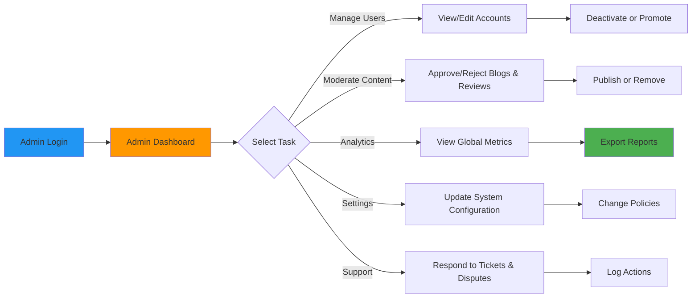
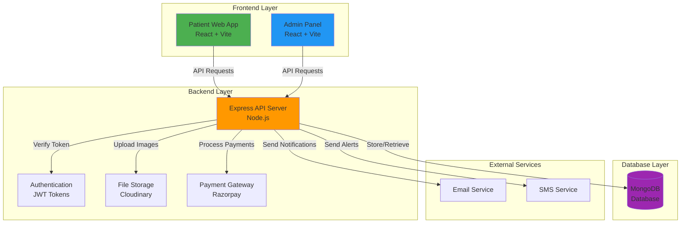
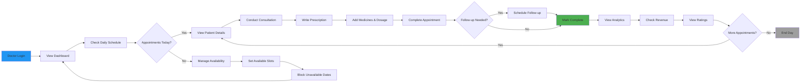
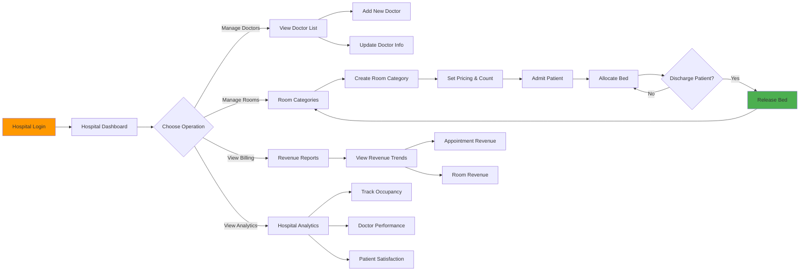

# Healhub - Hospital Management & Healthcare Booking Platform

## 🔗 Repository Links

[](https://github.com/charanp2006/healhub-frontend)

[](https://github.com/charanp2006/healhub-backend)

[](https://github.com/charanp2006/healhub-admin)


## 🏥📱 What is Healhub?

Healhub is a modern, all-in-one healthcare management platform designed to revolutionize how patients, doctors, and hospitals interact with each other. Think of it as the "Uber for healthcare" - a seamless digital bridge that connects patients looking for medical services with qualified doctors and well-equipped hospitals in their area.

The platform solves real-world healthcare challenges:
- **For Patients**: No more lengthy phone calls to book appointments, waiting in clinic queues, or struggling to find the right doctor
- **For Doctors**: Organize appointments efficiently, manage patient records, and grow their practice with real-time analytics
- **For Hospitals**: Manage rooms and beds in real-time, track revenue, connect with doctors, and serve patients better
- **For Administrators**: Monitor the entire platform, ensure quality control, and drive business growth with data-driven insights

## 🎯 How Healhub Works - A Complete Picture

### The Patient Journey
1. **Discovery Phase**: A patient visits Healhub and discovers doctors by speciality (Cardiology, Dermatology, etc.) and hospitals in their area
2. **Selection Phase**: They view doctor profiles with detailed info (experience, fees, ratings, reviews)
3. **Booking Phase**: Select a convenient date and time slot, choose between in-person or video appointment
4. **Payment Phase**: Make secure payment through Razorpay with multiple payment options
5. **Appointment Phase**: Receive appointment confirmation and reminders
6. **Consultation Phase**: Attend the appointment (in-person or via video call)
7. **Follow-up Phase**: Receive prescriptions, medical reports, and book follow-up appointments if needed

### The Doctor Workflow
1. **Registration**: Join the platform and set up their professional profile
2. **Hospital Affiliation**: Connect with one or more hospitals
3. **Schedule Management**: Set available time slots and manage their calendar
4. **Appointment Management**: Accept appointments and track upcoming consultations
5. **Consultation**: Complete consultations and add prescriptions
6. **Analytics**: View their performance metrics (appointments, ratings, revenue)
7. **Growth**: Build reputation through patient reviews and ratings

### The Hospital Operations
1. **Setup**: Register hospital, add details, and set up their profile
2. **Doctor Network**: Manage doctors working at their facility
3. **Resources**: Add room categories (General Ward, ICU, Private Room, etc.), manage bed allocation
4. **Patient Management**: Track patient admissions and discharges
5. **Revenue Tracking**: Monitor earnings, billing, and financial reports
6. **Content**: Publish health awareness blogs and articles
7. **Analytics**: Get insights into hospital performance and utilization

### Administrator Operations
1. **User Oversight**: View and manage patient, doctor, and hospital accounts
2. **Content Moderation**: Approve or remove blogs, reviews, and other platform content
3. **Analytics Dashboard**: Access global metrics across users, appointments, and revenue
4. **System Settings**: Configure platform-wide preferences and security policies
5. **Issue Resolution**: Handle support tickets, disputes, and abuse reports
6. **Audit Logs**: Review activity history for compliance and debugging
7. **Role Management**: Assign and update roles/permissions for internal staff




## ⭐ Recent Enhancements

- **Rating & Reviews**: Patients can rate doctors and hospitals after completed appointments. Ratings are aggregated and visible across patient, doctor, hospital, and admin panels.
- **Statistics Components**: Home page shows dynamic user/doctor/hospital counters and a scrolling services carousel.
- **Floating Demo Button**: A persistent floating button leads to the demo page with animations.
- **Terminology Update**: "Hospital" renamed to "Hospital/Clinic" throughout the app for clarity.
- **Doctor Availability Integration**: Booking slots automatically adjust based on doctor availability calendar.

## 🔄 Application Flow Diagrams

### System Architecture



### Patient Journey Flow

```mermaid
flowchart LR
    A[Patient Visits Healhub] --> B{Registered?}
    B -->|No| C[Sign Up]
    B -->|Yes| D[Login]
    C --> D
    D --> E[Browse Doctors/Hospitals]
    E --> F{Filter by Speciality?}
    F -->|Yes| G[Apply Filters]
    F -->|No| H[View All]
    G --> H
    H --> I[Select Doctor]
    I --> J[View Profile & Reviews]
    J --> K{Book Appointment?}
    K -->|No| E
    K -->|Yes| L[Select Date & Time]
    L --> M[Choose Type: In-person/Video]
    M --> N[Add Symptoms/Notes]
    N --> O[Proceed to Payment]
    O --> P{Payment Method}
    P -->|Card| Q[Card Payment]
    P -->|UPI| R[UPI Payment]
    P -->|Wallet| S[Wallet Payment]
    Q --> T[Payment Success]
    R --> T
    S --> T
    T --> U[Booking Confirmed]
    U --> V[Receive Confirmation Email]
    V --> W[Attend Appointment]
    W --> X[Receive Prescription]
    X --> Y{Need Follow-up?}
    Y -->|Yes| L
    Y -->|No| Z[Rate & Review]
    Z --> AA[End]
    
    style A fill:#4CAF50
    style T fill:#4CAF50
    style U fill:#4CAF50
    style AA fill:#2196F3
```



### Doctor Workflow



### Hospital Operations Flow



---

## 👥 Detailed Feature Explanation by User Type

### 🩺 **FOR PATIENTS** - The Complete Healthcare Companion

#### 1. **Doctor Discovery & Search**
- **Browse All Doctors**: Search through a comprehensive database of doctors with detailed profiles
- **Filter by Speciality**: Find doctors by their specialization area
  - General Practice (GP)
  - Cardiology (Heart specialists)
  - Dermatology (Skin specialists)
  - Pediatrics (Child specialists)
  - Orthopedics (Bone specialists)
  - And many more...
- **View Ratings & Reviews**: See real patient feedback and ratings (1-5 stars)
- **Check Appointment Fees**: Know the consultation cost upfront before booking
- **Verify Credentials**: Check doctor's education, experience, and certifications

**Real-World Example**: Rajesh has chest pain and needs a cardiologist. He opens Healhub, filters doctors by "Cardiology" in his city, sees Dr. Singh with 4.8 stars, checks his 15 years of experience, and books within 2 minutes.

#### 2. **Hospital Browsing & Profiles**
- **Find Hospitals Near You**: Discover hospitals in your area with complete information
- **View Hospital Details**: 
  - Hospital name, address, and contact information
  - Available specialties and services
  - General ratings and patient feedback
  - Estimated wait times
- **Check Facilities**: View available rooms and bed information
  - General Wards
  - Semi-Private Rooms
  - Private Rooms
  - ICU Facilities
  - Separate information for each room type

**Real-World Example**: Priya's mother needs hospitalization. She browses hospitals on Healhub, checks available beds, reads reviews from other patients, and pre-books a private room before arrival.

#### 3. **Smart Appointment Booking**
- **Select Date**: Pick any date using an interactive calendar
- **Choose Time Slots**: See doctor's available time slots and their availability
- **Flexible Appointment Types**:
  - **In-Person**: Visit the hospital/clinic for face-to-face consultation
  - **Video Consultation**: Consult from home via secure video call
- **Add Medical Context**:
  - Describe your symptoms
  - Add medical history notes
  - Mention previous treatments
  - Provide additional information for the doctor
- **Real-Time Availability**: System automatically shows only available slots, no overbooking

**Real-World Example**: Amit has a skin issue. He books Dr. Patel's appointment for Saturday 3 PM (video call), explains his symptoms, pays ₹500, and gets confirmation with doctor's contact details.

#### 4. **Secure Payment & Multiple Options**
- **Razorpay Integration**: Use any major payment method
  - Credit/Debit Card (Visa, Mastercard, RuPay)
  - Internet Banking (All major banks)
  - UPI (Google Pay, PhonePe, Paytm, etc.)
  - Wallet services
  - EMI options for larger amounts
- **Transparent Pricing**: No hidden charges, see full cost breakdown
- **Instant Confirmation**: Payment verified immediately, appointment confirmed
- **Digital Receipt**: Receive payment receipt and booking confirmation via email

**Real-World Example**: Sneha books an appointment for ₹800. She chooses to pay via Google Pay UPI, transaction completes in 5 seconds, and she gets instant booking confirmation.

#### 5. **Appointment Management Dashboard**
- **Upcoming Appointments**: See all scheduled appointments in a timeline
- **Appointment Details**: 
  - Doctor name and speciality
  - Date, time, and appointment type
  - Hospital/clinic location with directions
  - Doctor's contact information
  - Meeting link (for video appointments)
- **Cancel or Reschedule**: Change appointment time if needed
- **Appointment Status**: Track if appointment is:
  - Scheduled
  - In-Progress
  - Completed
  - Cancelled
- **Appointment History**: View all past consultations

**Real-World Example**: Vikram has an appointment tomorrow. He opens his dashboard, sees all details, gets directions to the hospital, and has the video call link ready before the appointment time.

#### 6. **Prescriptions & Medical Records**
- **Digital Prescriptions**: Receive doctor's prescription digitally after consultation
- **View Medications**: Complete list of medicines prescribed with dosage and duration
  - Medicine name
  - Dosage (e.g., 500mg)
  - Frequency (e.g., twice daily)
  - Duration (e.g., 10 days)
  - Special instructions
- **Download & Share**: Download prescriptions as PDF to share with pharmacist or family
- **Medical History**: Keep track of all consultations and treatments

**Real-World Example**: After consulting Dr. Gupta for fever, Shweta receives a digital prescription on Healhub. She downloads it, shows it to the pharmacist, and gets medicines without any confusion.

#### 7. **Doctor & Hospital Ratings**
- **Rate After Consultation**: Give ratings and reviews after appointment completion
- **Detailed Feedback**: Share your experience
  - Doctor's listening skills and support
  - Treatment effectiveness
  - Clinic/hospital cleanliness
  - Overall experience
- **Help Others**: Your reviews help future patients make better decisions
- **Anonymous Option**: Rate without revealing your identity if desired

**Real-World Example**: After a successful treatment, Neha rates Dr. Mehta 5 stars and writes: "Very caring doctor, explained everything clearly, treatment worked within a week!"

#### 8. **Health Blogs & Articles**
- **Read Health Tips**: Educational content written by doctors and hospitals
  - "How to Manage Diabetes"
  - "Healthy Heart: Prevention Tips"
  - "Child Nutrition Guide"
  - "Stress Management Techniques"
- **Filter by Category**: Find articles on specific health topics
- **Doctor Authored**: Content written by medical professionals
- **Free Access**: All health information available free of cost

**Real-World Example**: Kavya wants to understand hypertension. She reads a detailed blog by Dr. Iyer on Healhub about causes, symptoms, prevention, and management.

#### 9. **User Profile & Medical History**
- **Personal Information**:
  - Name, email, phone number
  - Date of birth and gender
  - Address and location preferences
- **Health Profile**:
  - Medical history (previous illnesses)
  - Allergies
  - Current medications
  - Emergency contact information
- **Save Preferences**:
  - Preferred doctors
  - Preferred hospitals
  - Preferred appointment types

**Real-World Example**: Rohit updates his profile with his allergy to penicillin. When booking appointments, this information is automatically visible to doctors, preventing any medication conflicts.

---

### 👨‍⚕️ **FOR DOCTORS** - Practice Management & Growth

#### 1. **Professional Profile Management**
- **Complete Registration**: Set up comprehensive profile with:
  - Educational qualifications (MBBS, MD, etc.)
  - Specialisation and sub-specialisation
  - Years of experience
  - Licenses and certifications
  - Hospital affiliations
  - Professional biography
- **Profile Photo**: Upload a professional photograph
- **Verification**: Get verified badge after basic credentials check
- **Trust Building**: Complete profile helps build patient trust

**Real-World Example**: Dr. Sharma registers as a Cardiologist with 20 years experience, uploads his MD certificate, and gets a verified badge, making patients more confident.

#### 2. **Appointment Calendar & Scheduling**
- **Set Availability**: Define working hours for each day
  - Morning slots (e.g., 9 AM - 1 PM)
  - Afternoon slots (e.g., 2 PM - 6 PM)
  - Evening slots (e.g., 6 PM - 9 PM)
- **Create Time Slots**: Set appointment duration (e.g., 15-min, 30-min, 60-min slots)
- **Block Calendar**: Mark dates/times when unavailable (holidays, conferences, leave)
- **Real-Time Sync**: Calendar updates instantly when patients book
- **Reduce No-Shows**: Automated reminders to patients before appointments

**Real-World Example**: Dr. Verma sets slots: Monday-Friday 10 AM-1 PM (15-min slots), Wednesday and Sunday off. When patients book, slots are automatically blocked.

#### 3. **Appointment Management**
- **View Daily Schedule**: See all appointments for the day with patient details
- **Patient Information**:
  - Patient name and contact
  - Symptoms/reason for visit
  - Medical history
  - Previous consultations
- **Complete After Consultation**: Mark appointment as completed
- **Add Prescriptions**: Write detailed prescription with medicines and advice
- **Add Follow-up**: Schedule follow-up appointment if needed

**Real-World Example**: Dr. Patel sees his 10 AM appointment with patient Anjali for back pain, reviews her history, conducts consultation, prescribes medicines, and schedules follow-up in 2 weeks.

#### 4. **Prescription Writing**
- **Digital Prescriptions**: Write prescriptions digitally (no paper needed)
- **Complete Medication Details**:
  - List all medicines prescribed
  - Dosage and frequency
  - Duration of treatment
  - Special instructions (before/after food, etc.)
  - Precautions and side effects
- **Instant Delivery**: Patient receives prescription digitally immediately
- **Better Compliance**: Patients follow prescriptions more accurately when in digital format

**Real-World Example**: Dr. Khan prescribes for diabetes: Metformin 500mg twice daily for 3 months, with instructions to take after food. Patient gets this on Healhub instantly.

#### 5. **Patient History & Records**
- **Access Medical Records**: See all patient interactions and consultations
- **Treatment History**: Track all treatments given over time
- **Continuity of Care**: Know what other doctors have prescribed
- **Better Decision Making**: Make informed decisions based on complete history

**Real-World Example**: When Mr. Desai visits for second time, Dr. Nair sees his previous consultation notes, understands the treatment given, and builds on that.

#### 6. **Ratings & Reviews**
- **Patient Reviews**: View feedback from patients
- **Rating History**: See trend of your ratings over time
- **Build Reputation**: More ratings lead to more bookings
- **Average Rating**: Displayed prominently on your profile (5-star system)

**Real-World Example**: Dr. Ghosh maintains 4.9 stars after 200+ patient reviews, making him one of the most booked doctors on the platform.

#### 7. **Earnings & Analytics**
- **Revenue Dashboard**: See earnings from appointments
  - Total earnings
  - Appointments completed
  - Average consultation fee
  - Monthly revenue trend
- **Performance Metrics**:
  - Total patients consulted
  - Patient satisfaction ratings
  - Most booked time slots
  - Busiest days/times
- **Insights**: Understand your practice patterns

**Real-World Example**: Dr. Bansal sees that he earned ₹45,000 this month from 90 appointments, with his evening slots (6-8 PM) being most popular.

#### 8. **Blog Publishing**
- **Write Health Articles**: Share medical knowledge with patients
- **Educational Content**: Publish tips, guides, case studies
- **Patient Education**: Help patients understand health conditions
- **Build Authority**: Establish yourself as an expert

**Real-World Example**: Dr. Chatterjee publishes a blog "10 Exercise Tips for Arthritis Patients" which gets 5,000+ views and helps patients even before they consult.

#### 9. **Hospital Management**
- **Affiliate with Hospitals**: Connect with one or more hospitals
- **Manage Hospital Details**: Update which hospitals you work at and on which days
- **Coordination**: Sync appointments across multiple hospital affiliations

**Real-World Example**: Dr. Joshi works at City Hospital on Mondays-Wednesdays and Private Hospital on Thursdays-Saturdays, managing both schedules on Healhub.

---

### 🏥 **FOR HOSPITALS** - Operations & Growth Management

#### 1. **Hospital Profile & Registration**
- **Complete Information**:
  - Hospital name and address
  - Contact details and website
  - List of specialties available
  - Emergency services info
  - Opening hours
  - Parking and accessibility info
- **Hospital Photo**: Upload hospital images
- **Verification**: Get verified badge
- **Ratings**: Patient ratings and reviews

**Real-World Example**: City Hospital registers with all 15 specialties, uploads photos of their ER and operation theaters, and gets verified within 2 days.

#### 2. **Doctor Network Management**
- **Add Doctors**: Onboard doctors to work at your hospital
- **Doctor Profiles**: View all doctors' credentials and specialties
- **Schedule Management**: See when each doctor is available
- **Doctor Performance**: Track which doctors are most booked

**Real-World Example**: Metro Hospital adds 50 doctors across 12 specialties. They can see that cardiologists Dr. Singh and Dr. Verma are their top performers.

#### 3. **Room & Bed Management**
- **Create Room Categories**:
  - **General Ward**: Large room, 2-4 beds, basic facilities
  - **Semi-Private**: 2 beds, attached bathroom, TV
  - **Private Room**: 1 bed, full amenities, AC, TV
  - **ICU**: Critical care with ventilators and monitors
  - **HDU**: High dependency unit
  - **NICU**: Neonatal ICU
  
#### 4. **Detailed Real-Time Bed Management**
- **Track Occupancy**: 
  - See real-time bed availability
  - Total beds vs. occupied beds for each category
  - Percentage occupancy
  - Availability at a glance
  
- **Admit Patients**:
  - Enter patient name and details
  - Assign room category
  - Set admission date
  - Add medical notes
  - Assign primary doctor
  
- **Discharge Patients**:
  - Mark room as discharged
  - Generate discharge summary
  - Automatic billing calculation
  - Free up bed for next patient
  
- **Historical Data**:
  - View admission/discharge history
  - Track which patients stayed in which rooms
  - Length of stay calculations
  - Revenue per room

**Real-World Example**: Star Hospital has 100 beds. On a given day:
- General Ward: 20/25 beds occupied (80%)
- Private Rooms: 18/30 occupied (60%)
- ICU: 8/10 occupied (80%)
They see these metrics in real-time and can make informed decisions about pricing and promotions.

#### 5. **Billing & Revenue Management**
- **Automatic Calculations**: System calculates bills based on
  - Room charges per day
  - Doctor consultation fees
  - Procedure costs
  - Medication charges
  - Lab test costs
  - Equipment usage
  
- **Invoice Generation**: Create detailed invoices for patients
- **Payment Tracking**: See which invoices are paid and pending
- **Revenue Reports**: Monthly, quarterly, annual reports
- **Insurance Integration**: Track insurance claims

**Real-World Example**: A patient admitted for 5 days in private room:
- Room charges: ₹2,500/day × 5 = ₹12,500
- Doctor fees: ₹2,000 × 3 visits = ₹6,000
- Medications: ₹5,000
- Tests: ₹3,000
- **Total Bill: ₹26,500**

#### 6. **Appointment Management**
- **See All Appointments**: View appointments at the hospital
- **Track No-Shows**: Monitor patient attendance
- **Resource Planning**: Ensure doctors and rooms are available
- **Patient Wait Times**: Reduce queues with better scheduling

**Real-World Example**: Hope Hospital sees that 15% of patients miss appointments on Mondays. They start sending SMS reminders and reduce no-shows to 5%.

#### 7. **Blog Publishing & Content Marketing**
- **Health Awareness**: Publish articles about health conditions
- **Hospital Services**: Write about special services and departments
- **Patient Education**: Help patients understand treatments
- **Expert Articles**: Blogs by doctors on various topics
- **Reach Patients**: Build online presence and SEO

**Real-World Example**: Apollo Hospital publishes "Complete Guide to Open Heart Surgery" which attracts 10,000 patient visits in a month and converts 50 into consultations.

#### 8. **Hospital Analytics & Reporting**
- **Key Metrics Dashboard**:
  - Total appointments
  - Patient satisfaction ratings
  - Bed occupancy rates
  - Revenue analysis
  - Doctor performance rankings
  - Department-wise statistics
  
- **Trends & Patterns**:
  - Busiest departments
  - Peak hours and days
  - Most requested services
  - Seasonal variations
  
- **Financial Reports**:
  - Revenue by department
  - Doctor commission calculations
  - Operating costs vs. revenue
  - Profit margins

**Real-World Example**: Rainbow Hospital's analytics show:
- Cardiology department generates 40% of revenue
- ICU has 75% occupancy (best performing)
- October-November are peak months (40% higher revenue)
- They use this to hire more cardiologists and plan surgeries accordingly.

#### 9. **Quality Control & Compliance**
- **Staff Management**: Manage hospital staff on the platform
- **Service Feedback**: Monitor patient feedback systematically
- **Compliance Tracking**: Ensure all regulations are met
- **Certification**: Display certifications and accreditations

---

### 👔 **FOR ADMINISTRATORS** - Platform Management & Growth

#### 1. **Platform Dashboard Overview**
- **Key Metrics at a Glance**:
  - Total users registered
  - Total doctors on platform
  - Total hospitals
  - Total appointments conducted
  - Total revenue generated
  - Platform growth rate
  
- **Real-Time Monitoring**:
  - Current online users
  - Live bookings happening
  - New registrations
  - Active consultations

**Real-World Example**: On a Tuesday afternoon, the admin sees:
- 50,000 active users
- 200 live appointments happening
- 15 new doctors registered
- 8 new hospitals joined

#### 2. **Doctor Management**
- **Add New Doctors**: Register doctors on the platform
- **Verify Credentials**: Check:
  - Medical degree (MBBS, BDS, AYUSH, etc.)
  - Specialization certificates
  - License validity
  - Experience verification
  - Background check
  
- **Edit/Update**: Modify doctor information
- **Suspend/Remove**: Remove doctors who violate policies
- **Performance Monitoring**: 
  - Track ratings and reviews
  - Monitor complaint patterns
  - See appointment completion rates

**Real-World Example**: Admin verifies Dr. Sharma's:
- MBBS from Delhi University (valid)
- MD in Cardiology (verified)
- Medical license (current and valid)
- 12 years experience (confirmed)
Then approves the registration.

#### 3. **Hospital Management**
- **Register Hospitals**: Add hospital information
- **Verify Details**: Confirm hospital registration, licenses, accreditations
- **Monitor Performance**: Track:
  - Bed occupancy rates
  - Appointment volumes
  - Patient satisfaction scores
  - Financial metrics
  
- **Manage Affiliations**: Add/remove doctors from hospitals
- **Compliance Check**: Ensure hospitals meet standards

**Real-World Example**: Admin verifies Metro Hospital's:
- Registration and business license
- MOA (Medical Association) recognition
- Safety certifications
- Doctor affiliations
- Then lists them on platform

#### 4. **Appointment Monitoring**
- **View All Appointments**: See system-wide appointment data
- **Filter & Search**: By doctor, hospital, date, status
- **Dispute Resolution**: Handle appointment-related complaints
  - Patient vs. Doctor disputes
  - Refund requests
  - Rescheduling issues
- **Quality Assurance**: Ensure good service quality

**Real-World Example**: If a patient complains that a doctor didn't show up, admin can see the appointment record, contact both parties, and process a refund.

#### 5. **Revenue & Financial Analytics**
- **System-Wide Revenue**:
  - Total commission earned
  - Revenue by category (consultations, room bookings, etc.)
  - Payment method analysis
  - Refund and dispute costs
  
- **Growth Metrics**:
  - Month-on-month revenue growth
  - Average transaction value
  - Customer lifetime value
  - Churn rate

**Real-World Example**: Last month Healhub:
- Generated ₹50 lakhs in consultations
- ₹30 lakhs from room bookings
- ₹20 lakhs in other services
- Showed 25% growth vs. previous month

#### 6. **Blog & Content Moderation**
- **Approve/Reject Blogs**: Review content before publishing
  - Check medical accuracy
  - Verify facts and citations
  - Remove misleading information
  - Ensure quality standards
  
- **Manage Categories**: Create and manage content categories
- **Feature Articles**: Promote high-quality content

**Real-World Example**: Admin reviews a blog by a doctor on diabetes treatment. Checks if information is accurate, citations are valid, then approves it for publishing.

#### 7. **Billing & Reconciliation**
- **Doctor Payments**: 
  - Calculate doctor commissions
  - Generate payment records
  - Process payouts
  - Handle disputes
  
- **Hospital Settlements**:
  - Calculate hospital earnings
  - Manage revenue sharing
  - Process transfers
  
- **Financial Reports**: Complete financial statements

**Real-World Example**: Dr. Singh earned ₹100,000 from 50 consultations. Admin calculates Healhub commission (20%), transfers ₹80,000 to doctor's account.

#### 8. **System Analytics & Dashboards**
- **Doctor Analytics**:
  - Top performing doctors
  - Highest rated doctors
  - Most booked doctors
  - New doctors performance
  - Doctor-wise revenue
  
- **Hospital Analytics**:
  - Top performing hospitals
  - Highest rated hospitals
  - Hospital occupancy trends
  - Hospital revenue analysis
  
- **User Analytics**:
  - Total users and growth
  - User retention rates
  - Geographic distribution
  - User behavior patterns

**Real-World Example**: Admin can see:
- Top 10 doctors have 40% of all bookings
- Cardiology generates 30% of revenue
- Delhi region has 50,000 users
- Repeat appointment rate is 45%

#### 9. **Complaint & Support Management**
- **Track Complaints**: 
  - Patient complaints about doctors
  - Doctor complaints about patients
  - Hospital service complaints
  - Technical/platform issues
  
- **Resolution Process**:
  - Log complaint
  - Investigate
  - Take action (warning, suspension, refund)
  - Document outcome
  
- **Feedback Systems**: Gather system-wide feedback

**Real-World Example**: If a patient complains that a doctor was rude:
1. Admin sees the complaint
2. Contacts both doctor and patient
3. If verified, sends warning to doctor
4. If serious, may suspend account
5. Processes refund or credit if needed

#### 10. **User Management**
- **Patient Management**:
  - View patient profiles
  - Handle account issues
  - Respond to support requests
  - Manage disputes
  
- **Doctor Compliance**:
  - Monitor adherence to guidelines
  - Check appointment completion
  - Review patient ratings
  - Manage credentials
  
- **Hospital Compliance**:
  - Verify operational standards
  - Check bed availability accuracy
  - Review billing practices
  - Monitor service quality

---

## 🏗️ Technology Stack

### Frontend & Admin
- **React 19** - Modern UI framework with hooks and latest features
- **Vite** - Lightning-fast build tool and development server
- **Tailwind CSS** - Utility-first CSS for responsive design
- **Axios** - HTTP client for API communication
- **React Router** - Client-side routing and navigation
- **Recharts** - Beautiful charts and graphs for analytics
- **React Toastify** - User notifications and feedback

### Backend
- **Node.js & Express** - Robust JavaScript runtime and server framework
- **MongoDB** - Flexible NoSQL database for scalability
- **Mongoose** - Object modeling for MongoDB
- **JWT** - Secure token-based authentication
- **Bcrypt** - Password hashing and security
- **Cloudinary** - Cloud-based image storage and optimization
- **Razorpay** - Payment gateway integration

---

## 💼 Real-World Business Model

### How Healhub Makes Money

1. **Consultation Commission** (Primary Revenue)
   - Takes small commission (10-20%) from each consultation fee
   - Example: Doctor charges ₹500, Healhub takes ₹75, doctor gets ₹425

2. **Room Booking Commission** (Secondary Revenue)
   - Commission on hospital room bookings
   - Example: ₹5,000 room booking, Healhub takes ₹500

3. **Premium Features** (Future)
   - Premium doctor profiles (featured listings)
   - Hospital advertising (promoted positions)
   - Analytics pro packages

4. **Data Insights** (Future)
   - Pharmaceutical companies interested in patient health trends
   - Insurance companies needing health data
   - Government health initiatives

---

## 🎓 Use Cases & Success Scenarios

### Case Study 1: Chronic Disease Management
**Scenario**: Rajesh has diabetes and needs regular monitoring
- **Without Healhub**: Must visit hospital every month, wait 2 hours, pay for consultation
- **With Healhub**: Video call every month from home, gets prescription instantly, tracks health digitally, saves ₹200 per visit

### Case Study 2: Hospital Capacity Planning
**Scenario**: ABC Hospital needs to understand occupancy patterns
- **Without Healhub**: Manual tracking, no data, makes guesses
- **With Healhub**: Sees real-time dashboards, knows ICU is 80% full, General ward 60%, can adjust staffing accordingly, increase revenue

### Case Study 3: Doctor Growth
**Scenario**: New doctor Dr. Sharma wants to grow practice
- **Without Healhub**: Rely on walk-ins, word-of-mouth, takes years to build reputation
- **With Healhub**: Gets 10 appointments in first week, builds 100+ patient reviews in 3 months, becomes top-rated, earns ₹1 lakh monthly

---

## 🔐 Security & Trust Features

- **Data Encryption**: All sensitive data encrypted in transit and at rest
- **HIPAA Compliance**: Follows healthcare data protection standards
- **Doctor Verification**: All doctors verified with credentials
- **Hospital Verification**: All hospitals checked before listing
- **Secure Payments**: PCI-DSS compliant payment processing via Razorpay
- **Privacy**: Strict patient privacy policies, GDPR compliant
- **Audit Trails**: All important actions logged for compliance

---

## 📊 Platform Metrics & Growth

When fully operational, Healhub aims to provide:

- **Healthcare Access**: 10,000+ verified doctors across 20+ specialties
- **Hospital Network**: 500+ hospitals and clinics
- **Geographic Reach**: Present in 50+ cities nationally
- **Patient Base**: 1 million+ active patients
- **Monthly Appointments**: 100,000+ appointments
- **Revenue Impact**: Doctors earn ₹5-10 lakhs per month
- **Hospital Efficiency**: Hospitals improve occupancy by 30%

---

## 🚀 Future Roadmap

- [ ] Mobile app for iOS and Android
- [ ] Telemedicine with AI-powered diagnosis support
- [ ] Integration with electronic health records (EHR)
- [ ] AI-powered doctor recommendation
- [ ] Insurance integration and claims processing
- [ ] Wellness programs and preventive care
- [ ] Mental health services
- [ ] Lab tests and home sampling
- [ ] Pharmacy integration
- [ ] Wellness tracking with wearables

---

## 📞 Getting Started

### Prerequisites
- Node.js (v14+)
- npm or yarn
- MongoDB
- Cloudinary account
- Razorpay account (for payments)

### Quick Setup

#### 1. Backend Setup
```bash
cd backend
npm install
cp .env.example .env
# Update .env with your credentials
npm start
```

#### 2. Frontend Setup
```bash
cd frontend
npm install
cp .env.example .env
npm run dev
```

#### 3. Admin Panel Setup
```bash
cd admin
npm install
cp .env.example .env
npm run dev
```

## 🌐 Environment Variables

Each project requires specific environment variables. See respective README files:
- [Frontend .env](./frontend/README.md#environment-variables)
- [Admin .env](./admin/README.md#environment-variables)
- [Backend .env](./backend/README.md#environment-variables)

---

## 📚 Documentation

- [Frontend Documentation](./frontend/README.md)
- [Admin Panel Documentation](./admin/README.md)
- [Backend API Documentation](./backend/README.md)

## 🤝 Contributing

1. Fork the repository
2. Create a feature branch (`git checkout -b feature/amazing-feature`)
3. Commit changes (`git commit -m 'Add amazing feature'`)
4. Push to branch (`git push origin feature/amazing-feature`)
5. Open a Pull Request

## 📄 License

This project is licensed under the MIT License - see the LICENSE file for details.

## 👥 Support

For issues and questions:
- Create an issue on GitHub
- Check existing documentation
- Review the troubleshooting section
- Email: support@healhub.com

## 🎯 Roadmap

- [ ] Mobile app (React Native)
- [ ] AI-powered doctor recommendation
- [ ] Telehealth with video recording
- [ ] Multi-language support (Hindi, Tamil, Telugu, etc.)
- [ ] Advanced scheduling and availability management
- [ ] Patient health records system
- [ ] Insurance integration
- [ ] Ambulance booking
- [ ] Medicine delivery
- [ ] Lab tests at home

## ✨ Key Differentiators

🏥 **Hospital Management**: Real-time bed allocation with occupancy tracking
🩺 **Doctor Growth**: Built-in tools to increase patient base and reputation
📱 **Patient Convenience**: One-stop solution for all healthcare needs
💰 **Revenue Transparency**: Clear breakdown of earnings for doctors and hospitals
📊 **Data-Driven**: Analytics and insights for better decision making
🔒 **Trust & Security**: Verified professionals and secure transactions

---

**Revolutionizing Healthcare, One Appointment at a Time! ❤️**

## 🔑 Key Features

### For Patients
- ✅ Browse and filter doctors by speciality
- ✅ View hospital profiles and ratings
- ✅ Book appointments with available time slots
- ✅ Choose appointment type (in-person or video)
- ✅ Manage appointment history
- ✅ View and download prescriptions
- ✅ Read health blogs and articles
- ✅ Secure payment integration

### For Doctors
- ✅ Manage profile and availability
- ✅ View daily appointments
- ✅ Complete appointments and add prescriptions
- ✅ Track patient history
- ✅ Publish health blogs
- ✅ View analytics (appointments, revenue, ratings)
- ✅ Manage schedule and blocked dates

### For Hospitals
- ✅ Manage doctor roster
- ✅ Manage room categories and bed allocation
- ✅ Admit/discharge patients
- ✅ Track revenue and billing
- ✅ Access analytics and reports
- ✅ Publish hospital blogs
- ✅ Manage hospital profile

### For Admins
- ✅ Complete platform overview
- ✅ Doctor and hospital management
- ✅ Appointment monitoring
- ✅ Revenue and analytics tracking
- ✅ Blog moderation
- ✅ Billing management
- ✅ System-wide analytics

## 📊 Database Schema

### Core Collections
- **Users** - Patient accounts
- **Doctors** - Doctor profiles and credentials
- **Hospitals** - Hospital information
- **Appointments** - Booking records
- **Rooms** - Room categories and allocations
- **Blogs** - Published articles
- **Billing** - Revenue tracking
- **Prescriptions** - Medical prescriptions

## 🔐 Authentication

Healhub uses JWT (JSON Web Tokens) for secure authentication:
- Admin tokens: `aToken`
- Doctor tokens: `dToken`
- Hospital tokens: `hToken`
- Patient tokens: `token`

All tokens are stored in localStorage and included in API requests.

## 💳 Payment Integration

Razorpay integration for secure appointment payments:
- Supports all major payment methods
- Instant payment confirmation
- Automated receipt generation
- Refund management

## 📡 API Endpoints

### Main Categories
- `/api/admin` - Admin operations
- `/api/doctor` - Doctor management
- `/api/user` - Patient operations
- `/api/hospital` - Hospital management
- `/api/bed` - Room/bed management
- `/api/blog` - Blog operations
- `/api/analytics` - Analytics data
- `/api/billing` - Billing operations

[Detailed API documentation →](./backend/README.md#api-endpoints)

## 🎨 UI/UX Features

- **Responsive Design**: Mobile-first approach
- **Modern UI**: Tailwind CSS with custom styling
- **Smooth Animations**: Polished user experience
- **Real-time Updates**: Live data synchronization
- **Accessible**: WCAG compliant design
- **Dark Mode Ready**: CSS variables for theming

## 📈 Analytics & Reporting

### Available Dashboards
- Admin overview (system metrics)
- Doctor performance leaderboard
- Hospital analytics
- Revenue trends
- Appointment trends
- User activity tracking

## 🛡️ Security Features

- ✅ JWT-based authentication
- ✅ Password hashing (bcrypt)
- ✅ Role-based access control (RBAC)
- ✅ Secure file uploads (Cloudinary)
- ✅ CORS protection
- ✅ Input validation and sanitization
- ✅ Secure payment handling

## 📝 Environment Variables

Each project requires specific environment variables. See respective README files:
- [Frontend .env](./frontend/README.md#environment-variables)
- [Admin .env](./admin/README.md#environment-variables)
- [Backend .env](./backend/README.md#environment-variables)

## 📦 Deployment

### Recommended Platforms
- **Frontend & Admin**: Vercel, Netlify
- **Backend**: Render, Railway, AWS
- **Database**: MongoDB Atlas
- **Storage**: Cloudinary

[Detailed deployment guide →](./backend/README.md#deployment)

## 🐛 Troubleshooting

### Common Issues

**Port Already in Use**
```bash
# Change port in backend Server.js or kill process
kill -9 $(lsof -t -i:4000)
```

**CORS Errors**
- Check backend CORS configuration
- Verify frontend URL in .env

**Database Connection Failed**
- Verify MongoDB connection string
- Check MongoDB Atlas whitelist

## 📚 Documentation

- [Frontend Documentation](./frontend/README.md)
- [Admin Panel Documentation](./admin/README.md)
- [Backend API Documentation](./backend/README.md)

## 🤝 Contributing

1. Fork the repository
2. Create a feature branch (`git checkout -b feature/amazing-feature`)
3. Commit changes (`git commit -m 'Add amazing feature'`)
4. Push to branch (`git push origin feature/amazing-feature`)
5. Open a Pull Request

## 📄 License

This project is licensed under the MIT License - see the LICENSE file for details.

## 👥 Support

For issues and questions:
- Create an issue on GitHub
- Check existing documentation
- Review the troubleshooting section

## 🎯 Roadmap

- [ ] Mobile app (React Native)
- [ ] Telehealth integration
- [ ] AI-powered doctor recommendation
- [ ] Multi-language support
- [ ] Advanced scheduling analytics
- [ ] Patient health records system
- [ ] Insurance integration

## ✨ Features Highlights

🏥 **Hospital Management**: Complete room and bed allocation system
💬 **Communication**: In-app messaging between patients and doctors
📊 **Analytics**: Comprehensive dashboards with insights
💰 **Revenue Tracking**: Detailed billing and payment management
🔒 **Security**: Enterprise-grade security measures
🚀 **Scalability**: Designed for growth

---

**Made with ❤️ for better healthcare**
